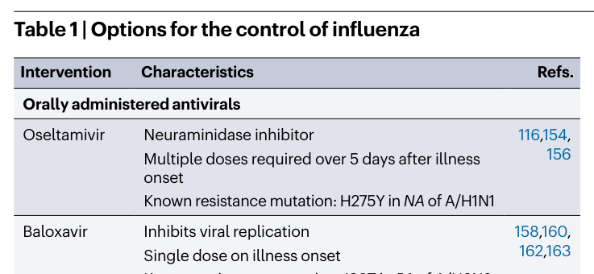
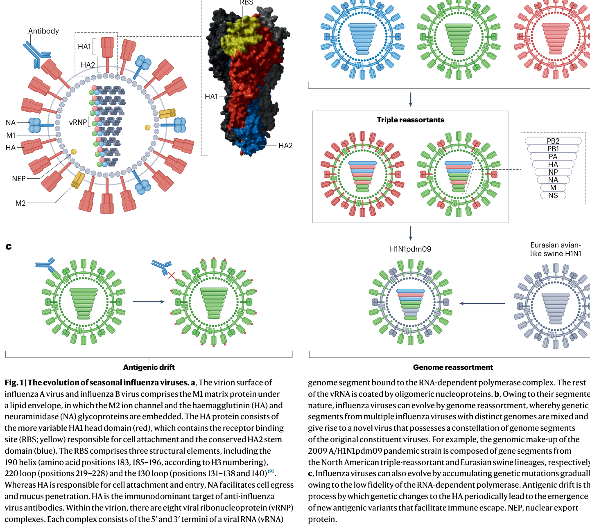
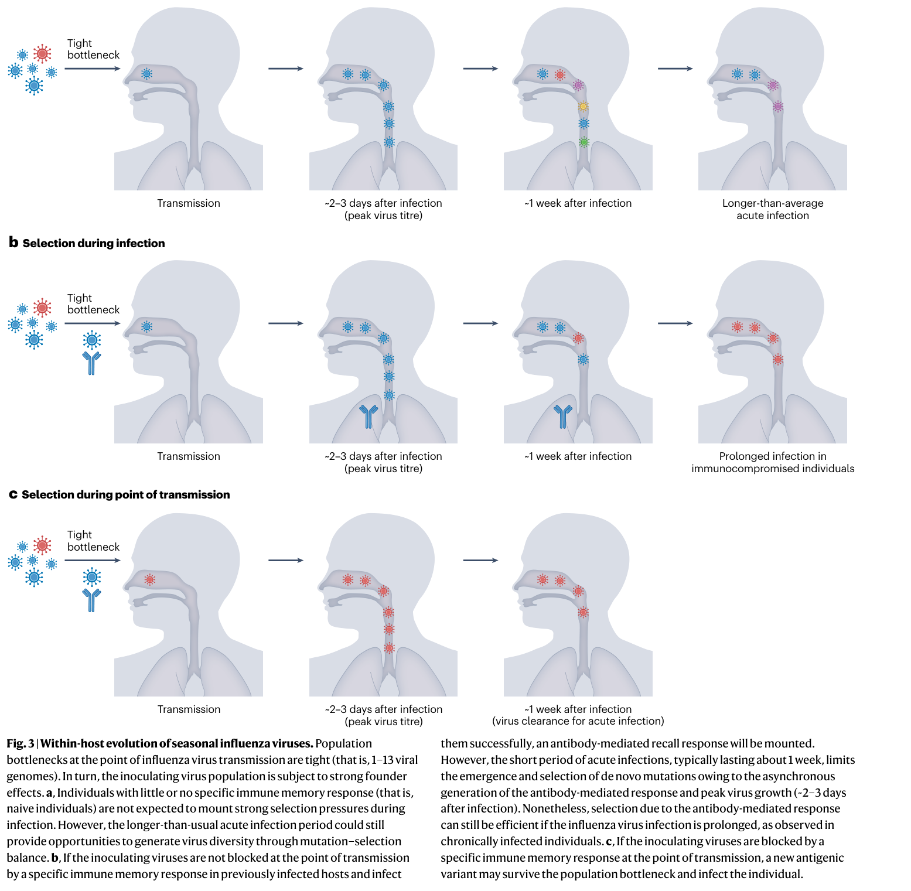

---
tags:
  - papers/流感进化与免疫
aliases:
  - Han et al. 2023 流感免疫共进化
  - 季节性流感病毒与免疫共进化综述
date: 2023
doi: 10.1038/s41579-023-00945-8
---

# Co-evolution of immunity and seasonal influenza viruses

## 核心信息

- 标题: Co-evolution of immunity and seasonal influenza viruses
- 标题翻译: 免疫与季节性流感病毒的共同进化
- 作者: Alvin X. Han, Simon P. J. de Jong, Colin A. Russell
- 机构: Amsterdam University Medical Centers, University of Amsterdam; Boston University
- 发表时间: 2023
- 发表渠道: Nature Reviews Microbiology
- DOI: 10.1038/s41579-023-00945-8
- 论文链接: https://doi.org/10.1038/s41579-023-00945-8
- 论文类型: 综述 (survey_or_review)

## 原文摘要翻译

季节性流感病毒通过不断进化以逃逸宿主免疫，造成反复的全球流行病。限制和驱动这些病毒进化的病毒约束与宿主免疫应答正日益被深入理解。然而，这些进展中的大多数如何提升我们减轻季节性流感病毒对人类健康影响的能力，仍不清楚。在本综述中，我们综合了近期在理解既往感染或疫苗接种所诱导的免疫进化与由人群中抗体介导免疫的异质性积累所驱动的季节性流感病毒进化之间相互作用方面取得的进展。我们讨论了限制病毒进化的功能约束、驱动新病毒变种出现的宿主内进化过程，以及当前和未来的流感病毒控制方案，包括为提升疫苗和抗病毒药物有效性所必须克服的病毒学和免疫学障碍。

## 创新点

1. **以免疫异质性作为统一的进化驱动框架**：本文的核心概念贡献是将原始抗原 sin（OAS）、抗原层级（antigenic seniority）、免疫印迹和出生队列效应整合为一个连贯的解释框架——人群中抗体介导免疫的异质性积累是季节性流感病毒抗原进化的核心驱动力，而非将这些现象视为独立观察。

2. **将传播瓶颈-免疫选择模型确立为解释进化节律的关键机制**：综述整合了宿主内进化研究和机制建模的最新证据，明确提出抗原变体更可能在传播给免疫宿主时被选择（而非在个体急性感染期间），从而解释了群体水平的抗原进化与个体宿主内低多样性的表观矛盾。

3. **超越 HA 中心视角的系统性整合**：不同于传统综述仅关注 HA 头部抗原漂移，本文同等重视 NA 抗原进化、HA 茎部抗体逃逸潜力、跨片段上位效应以及 HA-NA 功能平衡约束，构建了更完整的病毒进化图景。

4. **从进化-免疫共适应角度评估流感控制手段**：对疫苗和抗病毒药物的评估超越了传统的安全性/有效性框架，而是从病毒进化约束和免疫共进化动力学出发，分析各技术平台的根本性优势和免疫学障碍。

## 一句话总结

这篇综述以"免疫异质性→选择压力异质性→群体进化轨迹"为核心论证链，系统梳理了季节性流感病毒与人群免疫共同进化的分子机制、驱动因素、功能约束和生态动力学，指出理解免疫史的个体差异是预测病毒进化方向和设计更有效疫苗的关键。

## 研究问题

季节性流感病毒持续造成全球疾病负担的核心原因在于其抗原进化——即病毒通过不断改变表面糖蛋白以逃逸人群免疫。尽管过去二十年间，领域内对病毒进化的分子机制和宿主免疫应答的复杂性有了大量新认识，但一个根本性问题仍未解决：**为什么我们对病毒进化的理解日益深入，却未能显著提升减轻流感疾病负担的能力？**

本文试图通过以下具体问题来回答这一宏观挑战：

1. 个体层面高度异质的免疫史如何转化为群体层面的抗原选择压力？
2. 病毒的分子进化机制（氨基酸替换、糖基化屏蔽）如何与免疫选择相互作用？
3. 病毒自身的功能和生物物理约束如何限制其可用的进化路径？
4. 宿主内进化过程如何——以及在哪里——产生新的抗原变体？
5. 当前和新兴的流感控制手段在进化-免疫框架下各自面临什么根本性障碍？

## 数据与任务定义

### 综述范围

本综述聚焦于**甲型流感病毒（H3N2 亚型与 H1N1pdm09 亚型）和乙型流感病毒（Victoria 谱系与 Yamagata 谱系）**的人类适应性免疫应答。时间跨度覆盖 1918 年西班牙流感至 2022 年，核心关注 2000 年之后——高通量测序、深度突变扫描和系统动力学方法被广泛应用以来的进展。

### 纳入/排除标准

- **纳入**: 针对季节性流感病毒 HA 和 NA 的 B 细胞/抗体应答研究；HA/NA 抗原漂移的分子机制研究；宿主内流感病毒多样性的下一代测序研究；流感传播瓶颈的流行病学研究；流感疫苗和抗病毒药物的临床和免疫学研究。
- **排除**: 主要关注 T 细胞免疫的文献（仅在相关时简要提及）；动物流感病毒（除非与人类大流行起源直接相关）；流感 C 和 D 型（疾病负担有限）。

### 文献覆盖

综述引用了约 200 篇文献，涵盖分子病毒学、结构生物学、B 细胞免疫学、流行病学、系统动力学、临床研究和疫苗学。证据的学科跨度广泛但质量不均衡——从体外深度突变扫描的精确量化数据到基于生态学关联的流行病学推断。

## 方法主线

### 分类体系

综述采用**自下而上的分层组织逻辑**，从分子到个体再到群体：

- **抗体应答的分子和细胞基础** → HA/NA 结构、B 细胞激活、抗体效应功能
- **抗原漂移的分子机制** → 氨基酸替换（改变表位理化性质）、N-糖基化位点添加（空间屏蔽）
- **免疫选择的群体模式** → OAS、抗原层级、印迹效应、出生队列效应
- **病毒的生物物理和功能约束** → RBD 功能限制、上位效应网络、HA-NA 功能平衡
- **宿主内进化动力学** → 突变-选择平衡、传播瓶颈、传播点免疫选择
- **控制手段的进化和免疫学评估** → 抗病毒药物（奥司他韦、巴洛沙韦）、各代疫苗平台、通用疫苗策略

### 方法谱系

综述综合的证据类型包括：

| 证据类型 | 代表性方法 | 对应主题 |
|---------|-----------|---------|
| 结构生物学 | X 射线晶体学、冷冻电镜 | HA/NA 抗原位点定位 |
| 高通量突变筛选 | 深度突变扫描 | 氨基酸位点突变耐受性、逃逸突变识别 |
| 血清学 | HAI 测定、NAI 测定、抗原制图 | 抗原性表征、疫苗匹配评估 |
| 下一代测序 | 病毒全基因组测序、宿主内多样性格局 | 宿主内进化、传播瓶颈推断 |
| 数学建模 | 系统动力学、机制传播模型 | 抗原进化节律、传播选择模型 |
| 流行病学 | 出生队列分析、家庭传播研究、血清学队列 | 印迹效应、保护持续性 |

### 证据组织方式

作者的核心组织策略是将每条证据链置于**共同进化框架**下审视：每个层面的发现（从单个氨基酸突变到群体水平的抗原簇转换）都被解读为病毒逃逸压力与宿主免疫约束之间的动态平衡的结果，而非孤立现象。

## 关键结果

*Table 1: 流感控制手段的分类比较——口服抗病毒药物与各代疫苗技术平台的特点。*

### 代表性方向

#### 一、抗体应答的复杂性

- **HA 头部免疫优势**：HA 头部是抗体的主要靶标，其抗体与保护力相关。感染后抗体滴度平均提升 16 倍。保护力约 3–7 年减半，且甲型 H3N2 亚型的衰减速度快于甲型 H1N1pdm09 亚型。
- **HA 茎部的两难**：茎部序列保守、可诱导广泛保护，但免疫亚优势——仅在无头部匹配抗体时才被优先诱导。茎部抗体随年龄积累，老年人中水平最高。儿童几乎不产生茎部抗体。
- **NA 作为被忽视的靶标**：自然感染诱导大量 NA 抗体（与 HA 相当甚至更多），但目前疫苗几乎不诱导 NA 抗体。NAI 测定已被确立为独立于 HA 的保护相关指标。
- **感染 vs 疫苗接种**：疫苗不诱导 NP 抗体（感染会），且几乎不诱导 NA 抗体。近期感染者对疫苗接种的应答更强——感染和疫苗的相互作用塑造免疫应答。

#### 二、抗原漂移的分子机制

- 两种主要分子途径：**氨基酸替换**改变表位理化性质削弱抗体结合；**N-糖基化位点添加**在 HA 头部空间屏蔽抗体。
- H1 和 H3 HA 头部糖基化位点以 **5-7 年间期**增加，直到经验性糖基上限后转为位置交换而非新增。
- 抗原漂移的关键氨基酸位点已被精确界定，仅 **1-3 个氨基酸替换**即可驱动历史上主要的抗原簇转换：
  - H3: 位置 145, 155, 156, 158, 159, 189, 193（主要在抗原位点 B）
  - B 型: 位置 148, 149, 150, 203
- **神经氨酸酶的抗原漂移**独立于血凝素且与之不同步。2016 年后，N2 蛋白中第 245 位丝氨酸变为天冬酰胺及第 247 位丝氨酸变为苏氨酸，引入了糖基化位点；加之第 468 位脯氨酸变为组氨酸，这三处替换共同导致 N2 的实质性抗原漂移。

#### 三、免疫选择的群体模式

- **OAS 和抗原层级**：首次感染建立终身的免疫层级——感染前抗体滴度始终对最早接触的病毒最高。这一现象不仅限于 HA 头部，也适用于茎部抗体和跨亚型应答。
- **印迹效应**：首次感染亚型决定终身保护模式。1960–70 年代出生者可能被早期 H3N2 病毒印迹，对当前 3c2.A 分支持续易感——抗体能结合但无法中和近期毒株。
- **印迹的跨亚型保护**：2009 年大流行在老年队列中相对温和，因为他们对历史上的 H1N1 毒株已有免疫。类似地，早期 H3N2 感染可能保护个体免受 H7N9 的严重感染——因为 H3 和 H7 同属第 2 组血凝素。
- **个体异质性**：同一 HA 位点的点突变在一个人的血清中可能产生强逃逸效应，在另一个人的血清中几乎无影响——因为两人的感染史不同。这意味着**不同年龄组、出生队列和地理区域的人群对同一病毒施加不同的选择压力**。

#### 四、病毒进化的功能约束

- **受体结合域的功能约束**：抗原位点 B 与受体结合域高度重叠，涉及 H3 血凝素的第 156、158、159、190、193 和 196 位氨基酸。受体结合域中的功能必需残基——如第 98 位酪氨酸、第 153 位色氨酸和第 228 位丝氨酸——突变耐受性极低。免疫逃逸替换可能降低血凝素的受体结合亲和力。
- **上位效应提供出路**：尽管受 RBD 约束，HA 并未达到进化极限。220 loop 中的广泛上位效应持续为功能许可的进化路径创造条件。局部适应度景观随进化漂移，先前不可及的突变变得可及。
- **HA-NA 功能平衡**：血凝素的受体结合与神经氨酸酶的受体切割必须协调以维持病毒适应性，包括空气传播能力。神经氨酸酶通过跨片段上位效应约束血凝素的突变路径。N2 蛋白中多个氨基酸位点（第 248、249、336、344、356、385 和 387 位）的上位网络维持数十年，以保持神经氨酸酶的功能适应性。
- **种内重配**：季节性流感 A 型病毒之间种内重配频繁发生，可能在不改变 HA 抗原性的情况下提供适应性优势。

#### 五、宿主内进化与传播瓶颈

- 健康成人急性感染中流感病毒的宿主内多样性**极低**——纯化选择主导，而非阳性（抗原）选择。这解释了为什么从成人中采样的共有序列缺乏优先发现的抗原突变。
- 传播瓶颈极其狭窄：**1-13 个病毒基因组**。如此强的奠基者效应意味着宿主内产生的任何少数变异不太可能在传播中存活。
- **传播点选择模型**：机制建模表明，抗原变体可能更强烈地在传播给能产生抗体介导保护反应的免疫宿主时被选择，而非在典型的急性感染中产生。这一模型同时解释了群体水平的抗原进化和个体水平的低多样性。
- **例外情境**：免疫抑制个体的长期感染具有大的有效种群规模，并已检测到与全球进化一致的抗原突变选择。

#### 六、流感控制的当前与未来选项

- **抗病毒药物**：奥司他韦（NA 抑制剂，需 5 天多剂量，已知 H275Y 抗性突变）；巴洛沙韦（帽依赖性内切酶抑制剂，单剂量，已知 I38T 抗性突变）。广泛使用巴洛沙韦控制传播的潜力受限于需要大规模快速诊断基础设施。
- **疫苗平台**：
  - 鸡胚疫苗：成本低、成熟，但生产周期长（6-9 个月）、易产生鸡胚适应突变改变抗原性
  - 细胞培养疫苗：避免鸡胚适应问题，但制造成本高
  - 重组 HA 疫苗：可在 6-8 周内从序列到成品，老年人群中保护优于灭活疫苗
  - mRNA 疫苗（mRNA-1010）：抗原灵活性和生产速度最佳，初步数据显示四种亚型抗体均提升但 B 型和老年人增幅较低
- **通用疫苗进展**：HA 茎部疫苗（"无头"HA、嵌合 HA 构建体）、纳米颗粒平台组合多种抗原。mRNA 技术在组合多抗原方面具有独特优势。

### 共识与分歧

**领域共识**：
- HA 头部是免疫优势靶标，其抗原漂移由有限数量的关键氨基酸位点驱动
- OAS 和抗原层级型塑造终身的免疫应答层次
- 传播瓶颈极小，宿主内多样性在典型感染中很低
- 鸡胚适应突变是当前疫苗的主要局限性之一
- NA 是重要的保护靶标但当前疫苗基本忽略

**尚未解决的分歧**：
- HA 茎部是否——以及在多大程度上——会在自然免疫压力下发生抗原漂移
- 宿主内进化（尤其在儿童和免疫抑制者中）对全球进化的定量贡献
- "第一剂疫苗"应通过自然感染还是疫苗接种来建立——对儿童免疫策略有深远影响
- mRNA 疫苗在真实世界中的保护效力是否优于传统疫苗
- COVID-19 大流行造成的流感进化瓶颈将如何影响未来的抗原多样性

### 开放问题

1. 如何从个体的免疫史异质性中定量预测群体水平的进化轨迹？
2. H1 和 H3 茎部之间进化屏障的差异是否足够稳健到可以作为通用疫苗设计的依据？
3. NA 的独立抗原进化动力学如何与 HA 进化耦合？
4. 能否开发计算方法预测 HA 的进化极限——免疫逃逸与 RBD 功能约束的最终权衡点？
5. 跨片段上位相互作用在多大程度上限制了流感病毒的进化可塑性？

## 深度分析

### 核心论证链 1：免疫异质性 → 选择压力异质性 → 群体进化轨迹

这是综述最核心的概念贡献。论证路径如下：

OAS + 抗原层级 → 首次暴露终身上主导免疫应答 → 不同个体的感染史（暴露顺序、毒株抗原性差异）导致其对同一病毒变体施加完全不同的抗体选择压力 → 人群中累积的选择压力异质性决定了哪些抗原变体能够成功逃逸和传播。

**论证强度**：逻辑链清晰，各环节均有独立证据支持。但存在关键缺口——从"个体选择压力不同"到"群体进化方向"的跃迁缺乏定量化证据。我们不知道个体层面的异质性中有多少"平均化"掉了，又有多少转化为可检测的群体选择。Fig.2 的示意图优美但属概念层面，需要数学模型和流行病学数据的进一步验证。

**替代解释**：抗原变体的成功可能更多取决于其内在的传播适应性（受体结合亲和力、复制能力），而非对特定免疫谱的逃逸能力。免疫选择可能是必要条件但不是充要条件。

### 核心论证链 2：功能约束 + 上位效应 → 有限但持续的进化空间

论证路径：

RBD 功能必需残基突变耐受极低 → 免疫逃逸位点与 RBD 高度重叠 → 每次逃逸替换都可能损害受体结合 → 但上位效应持续重塑局部适应度景观 → 先前不可及的补偿突变在改变后的遗传背景下变得功能许可 → HA 未达进化极限。

**论证强度**：分子层面的证据质量最高（深度突变扫描 + 结构生物学）。220 loop 中上位效应的持续作用已获实验证明。但论证的关键弱点在于"未达极限"是一个无法证伪的声称——只要 HA 继续进化，我们就可以说"未达极限"；如果某天进化停止，这可能是达到了极限，也可能是选择压力减弱等其他原因。

### 核心论证链 3：传播瓶颈 + 传播点免疫选择 → 解释抗原进化节律

论证路径：

典型急性感染中宿主内多样性低 → 传播瓶颈极小（1-13 个基因组）→ 少数变异存活概率极低 → 但抗原变体仍在群体水平持续出现 → 因此抗原选择发生在传播点而非感染期 → 传播给免疫宿主时，仅携带免疫逃逸突变的病毒颗粒能克服黏膜 IgA 屏障 → 这解释了抗原进化的"间断平衡"模式（每 2-8 年一次抗原簇转换，而非连续漂移）。

**论证强度**：这一模型优雅地解决了多个表观矛盾，数学上自洽。但其经验基础仍然薄弱——直接观察传播点的选择事件极为困难，我们主要通过理论推断和间接证据支持这一模型。免疫抑制个体的长期感染提供了反例：如果传播点选择是唯一途径，那么免疫抑制者中观察到的抗原突变就不应反映全球进化趋势——但它们确实反映了。

### 分类体系的局限

综述的六层分类体系描述了从分子到群体的逻辑链，但存在以下局限：

1. **时间维度不足**：分类体系是空间/层级性的，忽略了进化的时间动态——不同层面的过程具有不同的特征时间尺度（氨基酸替换秒到分、糖基化固定数年、抗原簇转换数年到数十年），这些尺度的耦合方式是理解进化的关键但未被系统处理。
2. **公共卫生转化不足**：虽然综述反复提及"理解免疫共进化以改善控制"，但除了一般性建议外，未能提供从科学认识到公共卫生行动的具体转化路径。
3. **乙型流感的分析深度不足**：乙型流感的进化模式（两个谱系的长期共存、无动物储存库的特殊生态位）提供了与甲型对比的独特视角，但综述对乙型的分析深度明显低于甲型。

### 未覆盖区域

- T 细胞免疫在塑造流感进化中的作用（综述明确排除但值得纳入）
- 低资源环境中的流感进化和控制（综述证据主要来自高收入国家）
- 动物-人类界面中的进化动力学（仅在大流行背景下简要提及）
- 计算预测方法用于预测抗原进化的可能性和局限
- 季节性流感病毒之间的生态竞争（如 H1N1 和 H3N2 之间的相互作用）

### 后续研究机会

1. **整合个体免疫史推断与进化预测**：如果能从血清学数据重建个体的暴露史，就可能预测不同人群对不同候选疫苗病毒的应答模式。
2. **传播选择模型的直接验证**：需要在家庭传播研究中结合深度测序和血清学数据，在传播链上直接追踪抗原变体的命运。
3. **计算 HA 进化极限**：结合深度突变扫描数据、结构模型和群体遗传学，预测 HA 在不丧失功能的前提下能探索的序列空间边界。
4. **NA 靶向疫苗的临床开发**：鉴于 NA 的保护相关性和当前疫苗的 NA 缺失，开发诱导强 NA 抗体应答的疫苗策略是明确的转化机会。

*Fig. 1: 季节性流感病毒的进化。（子图一）病毒粒子表面结构，展示血凝素、神经氨酸酶、离子通道蛋白 M2 和基质蛋白 M1 的位置。（子图二）基因组重配导致大流行病毒出现，以 2009 年甲型 H1N1pdm09 为例。（子图三）抗原漂移——血凝素头部氨基酸突变累积导致新抗原变体出现。*

*Fig. 3: 季节性流感病毒的宿主内进化。传播瓶颈极紧（1–13 个病毒基因组），接种病毒群受强奠基者效应支配。（子图一）无特异性免疫记忆的个体在感染期间不施加强选择压力。（子图二）既往感染者的抗体介导回忆应答在约 1 周的急性感染期内与病毒峰值生长（感染后约 2–3 天）异步，限制了从头突变的出现和选择。（子图三）传播点——如果接种病毒在传播时被特异性免疫记忆阻断，携带逃逸突变的抗原变体可能存活并感染新宿主。*

> [!figure] Fig. 2 — 季节性流感病毒抗体动力学影响因素及其对病毒进化的影响
> 建议位置：深度分析 > 核心论证链 1
> 放置原因：此图图解了原始抗原 sin（OAS）、抗原层级和印迹效应的核心机制，用两个假设个体的终身抗体库进化说明免疫异质性如何驱动病毒进化。
> 当前状态：占位保留——提取图像因可视化质量门控被拒（large_text_block_suspected），无可供插入的可靠候选图像。

## 局限

### 综述层面的局限

1. **文献选择偏差**：综述主要集中在高收入国家的研究，低资源环境中的流感动力学可能显著不同（不同的感染率、营养和共感染背景、疫苗覆盖率）。
2. **证据质量的层级差异**：综述混合了来自体外实验（高内部效度但可能低外部效度）、流行病学队列（高外部效度但潜在混杂）和数学模型（逻辑自洽但依赖假设）的证据，未系统评估各类证据的权重差异。
3. **因果推断的约束**：综述中多次出现"可能"、"被认为"等语言，反映了从关联到因果的推断跳跃——这在综述中是合理的，但读者不应将这些推断误解为已确立的因果事实。
4. **B 型流感分析深度不足**：B 型流感约占流感疾病负担的 25%，但其在综述中的分析篇幅远不匹配这一比例。

### 综述所回顾证据的共性局限

1. **体外到体内的外推鸿沟**：深度突变扫描和逃逸突变筛选通常在体外进行（单一单克隆抗体或多克隆血清），无法完全捕捉体内生发中心选择、抗体亲和力成熟和免疫记忆复杂的动力学。
2. **健康成人偏倚**：宿主内进化的关键结论主要来自健康成人的研究，而对儿童（更长感染期、更少免疫记忆）和老年人（免疫衰老、有限抗体谱系多样性）的发现可能不能直接推广。
3. **传播选择模型缺乏直接验证**：传播点选择的机制模型具有吸引力但缺乏直接的经验验证——在传播链上追踪抗原变体命运的技术挑战巨大。
4. **mRNA 疫苗临床证据有限**：mRNA-1010 仅报告了初步免疫原性数据，真实世界的保护效力、持久性和安全性数据仍在收集中。

### 作者承认的局限

- COVID-19 大流行对流感进化的长期影响高度不确定
- 目前不清楚种内重配在多大程度上为流感病毒提供适应性优势
- HA 茎部在自然选择压力下是否以及如何抗原漂移仍未知
- 通用流感疫苗面临免疫亚优势和抗体多反应性等根本性生物物理限制

## 我的笔记

### 这篇论文为什么值得保留

这篇综述是我迄今为止读到的对季节性流感免疫-进化共同进化最系统的梳理。它的价值不在于报告新数据，而在于提供了一个概念框架——将 OAS、抗原层级、印迹效应和出生队列效应统一解释为"免疫异质性驱动进化"的不同表现，而非孤立现象。这一框架对于设计流感监测策略、预测抗原进化和制定疫苗接种政策都有直接启发意义。

### 与相关文献的关系

- **Krammer (2019)** Nature Reviews Immunology: 对 HA 抗体应答的综述，更侧重免疫学机制细节，但缺乏本文的进化视角。
- **Petrova & Russell (2018)** Nature Reviews Microbiology: 上一代流感进化综述，本文可视为其更新版——纳入了宿主内进化、NA 进化和传播选择模型的最新进展。
- **Koel et al. (2013)** Science: 界定了 H3N2 抗原漂移的关键氨基酸位点——本文多处引用的核心发现之一。

### 可以进一步追踪的方向

- NA 靶向疫苗的临床试验进展（查询 ClinicalTrials.gov）
- HA 茎部疫苗的最新临床数据（NIAID 资助的多个项目）
- COVID-19 后流感进化轨迹的实时追踪（GISAID 数据库）
- 免疫史推断方法的最新进展（血清学+建模）

### 与我的研究关联

（根据个人研究方向补充）

## 引用

Han AX, de Jong SPJ, Russell CA. Co-evolution of immunity and seasonal influenza viruses. *Nature Reviews Microbiology*. 2023. doi: [10.1038/s41579-023-00945-8](https://doi.org/10.1038/s41579-023-00945-8)
