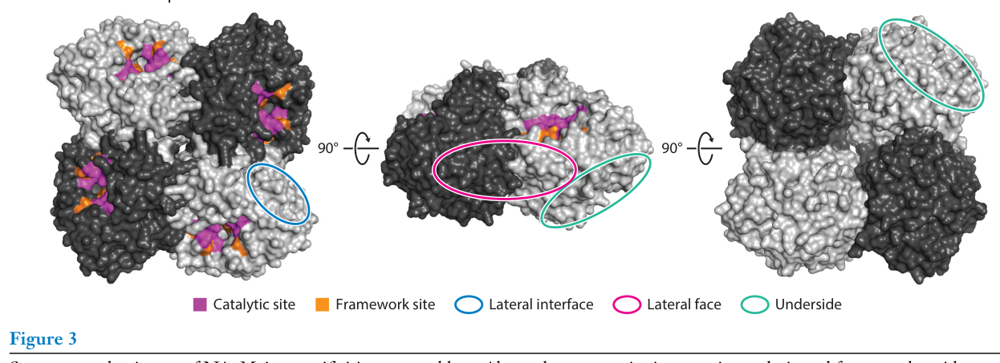
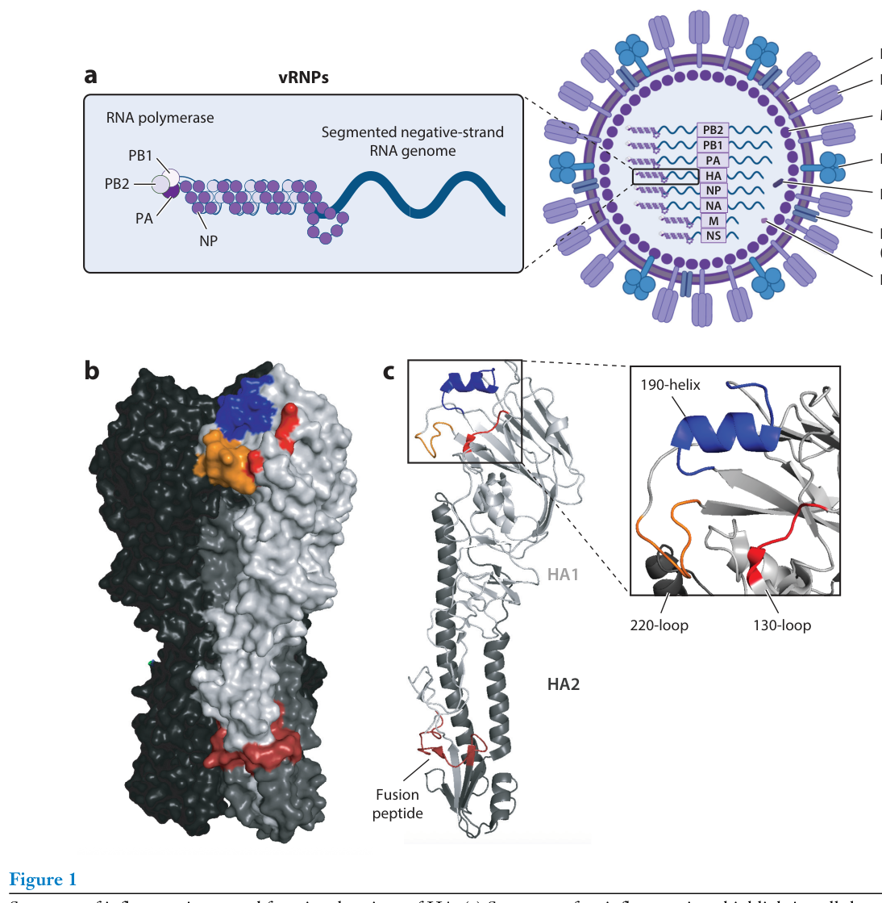
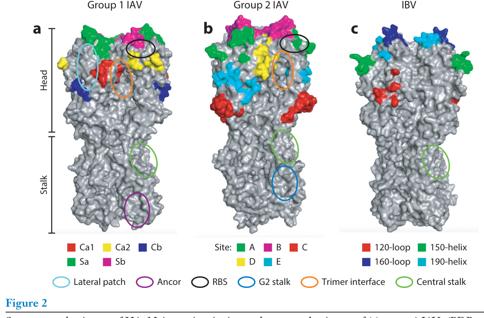
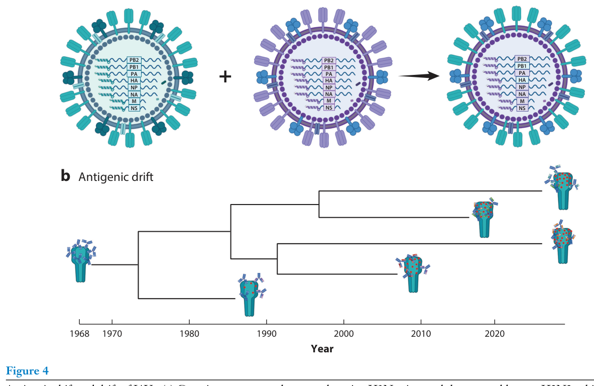

---
tags:
  - papers/流感进化与免疫
aliases:
  - "Good 2026 Antigenic Drift Review"
  - "流感病毒抗原漂移综述"
date: 2026-05-25
doi: "10.1146/annurev-virology-100424-103728"
---

# 流感病毒抗原漂移：适应性与免疫逃逸的平衡

## 核心信息

- 标题: Influenza Virus Antigenic Drift: Balancing Fitness and Immune Evasion
- 标题翻译: 流感病毒抗原漂移：适应性与免疫逃逸的平衡
- 作者: Marina R. Good, Jordan I. Lemus-Reyes, Jenna J. Guthmiller
- 机构: Department of Immunology and Microbiology, University of Colorado Anschutz Medical Campus
- 发表时间: 2026
- 发表渠道: Annual Review of Virology
- DOI: 10.1146/annurev-virology-100424-103728
- 论文链接: https://doi.org/10.1146/annurev-virology-100424-103728
- 论文类型: survey_or_review

## 原文摘要翻译

人类流感病毒展示出巨大的抗原变异性，以此作为逃避宿主免疫的策略。病毒通过进化来逃避宿主抗体应答的过程被称为抗原漂移，这使得流感病毒能够逃避表位特异性抗体，导致季节性流感暴发。中和抗体是抗原漂移的主要驱动力，它们靶向血凝素和神经氨酸酶中的广泛表位，包括功能保守区域。在这篇综述中，我们描述了流感病毒的抗体靶点、流感病毒如何进化以逃避这些抗体特异性，以及上位性如何帮助维持病毒适应性。随后，我们讨论了研究和预测抗原漂移的新兴方法，这些方法可能改进季节性流感疫苗的毒株选择。

## 创新点

1. **HA-NA上位性作为统一解释框架**：综述将HA和NA的协同进化系统性地整合为抗原漂移的核心约束条件，超越了以往仅关注单一蛋白的视角，提出"HA受体结合与NA酶活性处于同一连续谱的两端，需要等量但相反的功能"。

2. **HA茎部高遗传屏障的概念强化**：通过整合深度突变扫描和体外逃逸实验的多条证据链，系统论证了茎部逃逸需要多个突变、单突变不足以逃逸茎部抗体，为通用疫苗设计提供了关键的分子基础。

3. **NA糖基化作为抗原漂移核心机制的系统梳理**：综述首次将NA的N386K（去糖基化）和S245N/S247T（获得糖基化）等事件整合为统一的糖基化调控抗原漂移模型，揭示糖基化修饰同时影响抗原性和酶功能。

4. **免疫印记与抗原漂移的人群分层视角**：通过K166Q-lateral patch案例，阐明了出生年份/初次暴露病毒株如何决定个体对不同漂移变异株的易感性，将分子层面的抗原漂移与流行病学层面的人群风险联系起来。

## 一句话总结

这篇2026年发表于Annual Review of Virology的综述，以HA-NA功能上位性为核心框架，系统梳理了流感病毒如何在抗体逃逸与维持病毒适应性之间取得平衡，为通用疫苗设计和抗原漂移预测提供了分子层面的理论基础。

## 研究问题

流感病毒每年造成约50万人死亡，而季节性疫苗的有效性仅10%-60%。这种低效的核心原因在于**抗原漂移**（antigenic drift）——病毒通过积累突变来逃避宿主中和抗体的识别。然而，中和抗体主要靶向HA和NA上功能重要的区域（如受体结合位点RBS、NA酶活性位点），这意味着免疫逃逸突变不能随意发生：它必须在"逃逸抗体识别"和"维持蛋白功能"之间取得微妙的平衡。

这篇综述试图回答的核心问题是：**流感病毒如何在免疫逃逸和维持适应性之间取得平衡？** 具体分解为三个子问题：
- HA头部和茎部、NA各自如何通过不同的突变策略实现抗原漂移？
- HA和NA之间的上位性如何约束和塑造病毒的进化轨迹？
- 现有抗原漂移预测方法能否改进疫苗株选择？

## 数据与任务定义

### 综述范围

这是一篇面向病毒学、免疫学和疫苗学领域研究者的综合性综述。其覆盖范围包括：
- **病毒类型**：以甲型流感病毒（IAV）为主，兼顾乙型流感病毒（IBV），重点关注目前在人类中循环的H1N1和H3N2亚型
- **病毒蛋白**：血凝素（HA）和神经氨酸酶（NA），这是中和抗体的两个主要靶点
- **核心主题**：抗原漂移的分子机制、HA-NA上位性、疫苗株预测方法

### 纳入/排除标准

综述以2026年之前发表的同行评审文献为基础，涵盖结构生物学（X射线晶体学、冷冻电镜）、深度突变扫描（deep mutational scanning）、血清学分析、系统发育学和计算预测等多个方法学领域。综述不涉及流感病毒生命周期的基础机制细节（已由其他综述覆盖），也不涵盖细胞免疫（T细胞表位漂移）的详细讨论。

### 文献覆盖

引用文献涵盖1980年代HA抗原位点的经典定义到2025-2026年的最新预印本，时间跨度超过40年。关键引用包括Guthmiller等(2021)对H1N1初次暴露抗体应答的研究、Wu等(2020)对HA茎部抗体逃逸遗传屏障的深度突变扫描、Liu等(2022)对HA-NA上位性约束的定量研究，以及Shi等(2025)将AI应用于疫苗株选择的最新进展。

## 方法主线

### 分类体系

综述采用四层嵌套的分类体系来组织大量文献：

**第一层：病毒蛋白解剖学分类**
- HA头部域 → 五大主要抗原位点 + 三个保守表位（RBS、lateral patch、trimer interface）
- HA茎部域 → 中央茎部、锚定表位（group 1）、G2茎部表位（group 2）
- NA球状头部 → 酶活性位点、侧界面、侧面、底面

**第二层：抗原漂移策略分类**
- 主要抗原位点的高频突变（免疫优势驱动的恶性循环）
- 保守表位的精细调节（如RBS周边残基改变而非直接改变受体结合残基）
- 糖基化位点的获得/丢失（主要见于NA）
- 多突变累加与上位性补偿（主要见于HA茎部）

**第三层：蛋白间上位性约束**
- HA受体结合亲和力 ↔ NA酶活性的功能平衡
- 一方的变化为另一方创造或限制突变空间

**第四层：转化应用**
- 从分子机制到疫苗预测的方法学谱系

### 证据组织方式

综述以"典型案例"作为每个机制解释的核心证据锚点：
- **K166Q突变（2013-2014）** → 论证lateral patch表位的免疫优势和初次暴露印记
- **N386K去糖基化（2013前后）** → 论证NA糖基化调控抗原漂移
- **I45F突变** → 论证HA茎部逃逸的可能性和历史案例
- **H3N2受体偏好转变** → 论证HA-NA上位性驱动的长期进化

*Fig. 3. NA的结构与表位。展示了酶活性位点包含的催化残基和框架残基、侧面界面、侧面和底面的mAb靶向特异性（PDB: 3NSS）。*

## 关键结果

### HA头部漂移：免疫优势驱动的加速进化

**五大主要抗原位点**是抗体应答的主要靶点——在典型流感季节中，超过75%的H1头部抗体靶向这些位点。第一组甲型流感病毒的抗原位点命名为Sa、Sb、Ca1、Ca2、Cb，第二组则为位点A至E，乙型流感病毒则为120环、150环、160环和190螺旋。这些位点高度耐受突变，进化速率快于邻近残基，但不同位点的变异性不同（如Cb和Sb位点比其他位点更多变）。

> **关键含义**：这形成了一个"恶性循环"——主要抗原位点的快速漂移产生新变异株，激发新抗体应答，新抗体又驱动下一轮漂移。靶向这些位点的抗体提供极窄的保护谱。

**K166Q突变——lateral patch漂移的经典案例**：lateral patch位于HA头部背面，横跨Ca1、Cb和Sa抗原位点。2013-2014流感季H1N1病毒获得K166Q突变，导致中年成人（30-59岁，1977年首次暴露于H1N1者）发病率和死亡率异常升高。原因是这些人的初次暴露诱导了针对K166区域的集中抗体应答，而K166Q突变恰好逃逸了这一应答。相比之下，1985年后出生者（其初次暴露的病毒已在N129处获得N-糖基化遮蔽K166）产生的lateral patch抗体靶向下部区域，仍能中和K166Q突变株。

**RBS周边漂移——精细平衡**：RBS是HA最保守的功能区域之一。RBS特异性抗体通过HCDR3中的保守二肽基序模拟SA结合。病毒主要通过改变RBS周边残基（如190-helix、150-loop）而非RBS核心来逃逸这些抗体。H1N1在2009-2012年间同时获得增加亲和力（S186P/S188T）和降低亲和力（A137T/A200T）的突变，实现亲和力的精细调节。

### HA茎部漂移：高遗传屏障限制逃逸

HA茎部是广谱中和抗体的主要靶点，分为三个主要表位：中央茎部（central stalk）、锚定表位（anchor，仅group 1）和G2茎部表位（仅group 2）。茎部进化速率远慢于头部。

> **核心发现：茎部抗体逃逸需要多个突变。** 深度突变扫描显示，单突变几乎不能逃逸茎部靶向抗体（与头部抗体仅需一个突变即可逃逸形成鲜明对比）。体外选择的逃逸突变体即使获得多个突变，其病毒产量几乎总是低于野生型。

**例外与历史先例**：H2N2病毒（1957-1968年在人类中流行）在HA2残基45位携带苯丙氨酸（I45F），而所有其他group 1 IAV和禽类H2在此位置为异亮氨酸。深度突变扫描证实I45F可介导对VH1-69类中央茎部抗体的逃逸。作者推测这可能是H2N2在1957年出现后为逃避H1/H2交叉反应抗体而快速获得的关键突变。

### NA抗原漂移：糖基化调控

NA进化速率慢于HA，且NA的抗原漂移与HA的漂移不协调（discordant），表明两种糖蛋白承受着不同的选择压力。

**核心机制——糖基化位点的获得与丢失**：
- **N1 N386K（去糖基化）**：约2013年发生，导致N1抗原性发生自2009年H1N1出现以来最剧烈的变化，使针对A/California/7/2009的疫苗株特异性抗体效力显著降低
- **N2 S245N/S247T（获得糖基化）**：近期H3N2病毒在245位获得N-糖基化，阻断活性位点特异性抗体的结合，但同时损害NA的酶功能——这是适应性代价的典型案例
- **N2 K432E和I321V**：活性位点周边的突变驱动N1的抗原簇分化
- **N1 K390N**：侧面的抗原漂移可降低NAI活性但不完全消除Fc效应功能所需的结合亲和力

### HA-NA上位性：病毒适应性的核心约束

HA受体结合与NA酶活性处于同一功能连续谱上——一方增强，另一方也必须相应调整。抗原漂移突变虽然很少直接发生在RBS或NA活性位点内，但其周边突变可改变受体结合特性和酶功能。

**H3N2的长期进化案例**：
- 1990年代末至2000年代：H3N2受体结合亲和力下降 → 两种NA补偿事件出现（获得二次SA结合位点、筛选出NA缺失病毒），但这些变体在自然界罕见
- 2010年代初至今：H3N2获得对elongated poly-LacNAc上α2,6-SA的偏好（亲和力增强） → N2酶活性相应增强以维持平衡

**方向性尚不明确**：某些情况下NA活性的改变决定了HA的抗体逃逸突变选择；另一些情况下NA活性的降低则为HA创造了更大的突变探索空间。

### 抗原漂移预测与疫苗株选择

**现有流程的痛点**：北半球疫苗株选择在流感季期间进行，但实际疫苗使用要到约10个月后的下一个流感高峰，这种时间差经常导致疫苗错配。

**方法学演进**：
- 传统方法：ferret抗血清的血凝抑制（HI）实验 → 抗原制图（antigenic cartography）。局限：ferret单株感染血清无法反映人类的复杂免疫史
- 高通量中和实验：可高效检测人血清对多株病毒的中和效价，揭示了流行株与低抗体效价之间的强相关性
- AI方法：包括基于结构的预测、机器学习利用历史季节性数据、以及计算覆盖度评分和抗原性评分来指导疫苗株选择

## 深度分析

### 综述的核心论点：适应性约束是抗原漂移的"刹车"

综述最有力的论点是：流感病毒的抗原漂移不是无限制的随机突变过程，而是受到多重功能性约束的定向进化。这些约束包括：
- HA受体结合功能对RBS突变的内在限制
- NA酶活性对活性位点突变的功能限制
- HA-NA功能平衡对单一蛋白突变的系统性约束
- 茎部多突变需求带来的高遗传屏障
- 糖基化改变带来的适应性代价（如N2 S245N损害酶功能）

这些约束解释了为什么某些表位（如trimer interface、茎部）高度保守——不是因为它们不能突变，而是因为逃逸突变的适应性代价太高，无法在自然循环中维持。

### 综述的分类体系解释力与局限

综述的"蛋白 → 表位 → 机制 → 转化"四层分类体系具有很强的解释力，但存在几个盲区：

1. **IBV覆盖不足**：IBV仅在引言和若干零星段落中出现，缺乏对IBV抗原漂移分子机制的系统讨论（如B-Victoria和已灭绝的B-Yamagata谱系在抗原漂移策略上的差异）

2. **T细胞表位漂移被搁置**：综述明确将范围限定在体液免疫（抗体），但T细胞表位漂移可能在流感病毒的长期进化中同样重要

3. **Fc效应功能的独立进化压力未解决**：综述承认"不知道Fc介导的效应功能是否可以独立于中和作用驱动抗原漂移"——这是trimer interface保守性解释中的一个关键空白

4. **HA-NA上位性的因果方向未明确**：虽然综述提供了双向影响的案例，但未形成统一的方向性模型

### 与相关领域的比较定位

- 与通用流感疫苗研究的关系：综述为"茎部疫苗"策略提供了强有力的理论基础——茎部的高遗传屏障意味着逃逸风险较低
- 与SARS-CoV-2进化研究的对话：流感抗原漂移的精细平衡机制为理解其他RNA病毒的免疫逃逸提供了参考框架，但流感特有的HA-NA上位性是独特的

### 未覆盖区域和后续研究机会

1. **计算预测与实际疫苗效力的闭环验证**：AI预测模型虽已展示出潜力，但缺乏"预测→实际疫苗株部署→人群效力验证"的完整闭环研究

2. **免疫印记的定量模型**：综述定性描述了初次暴露对后续应答的影响，但缺乏可量化的预测模型

3. **NA疫苗的独立价值**：考虑到NA漂移与HA漂移不协调，NA特异性疫苗是否可以作为HA疫苗的补充来减轻错配风险？

## 局限

1. **综述覆盖以IAV为主，IBV信息不足**：对B-Victoria谱系（目前唯一流行的人类IBV）的抗原漂移机制讨论极为有限，且B-Yamagata谱系灭绝后的进化生态学后果未被充分展开

2. **依赖体外和深度突变扫描证据**：许多关于茎部逃逸遗传屏障的结论来自体外实验，这些结果在自然感染和人群传播中的外推性需要谨慎评估

3. **Fc效应功能与抗原漂移的关系未解决**：综述多次承认不知道Fc效应功能是否能独立于中和作用驱动抗原漂移，这是trimer interface等非中和表位保守性解释的关键空白

4. **缺乏系统性的定量元分析**：作为叙述性综述而非系统性综述或元分析，文献选择可能存在作者偏好，且不同研究间的定量比较困难

5. **NA抗原漂移的空间维度探索不足**：综述提到NA侧面和底面的突变可逃逸抗体"通过未知机制"，表明该领域的方法学分辨率仍有待提升

## 我的笔记

### 为什么值得读

这篇综述是理解流感病毒进化逻辑的一站式入门。它将结构生物学、免疫学、进化生物学和疫苗学整合在一个统一框架中，以"适应性约束"为红线串联起看似分散的分子机制。对于从事流感疫苗设计、病毒进化建模、或广谱抗病毒策略研究的人来说，这篇综述提供了关键的概念基础。

### 对疫苗设计的核心启示

1. **茎部是更安全的广谱靶点**：需要多突变才能逃逸意味着茎部疫苗的逃逸风险远低于头部疫苗

2. **NA不应被忽视**：当前季节性疫苗主要诱导HA抗体，但NA抗体是独立的保护相关因素，且NA漂移与HA漂移不协调——仅关注HA可能遗漏重要的抗原变化

3. **免疫印记需要纳入疫苗策略**：不同年龄组对同一漂移变异株的易感性不同，暗示未来可能需要按出生年份/初次暴露亚型分层制定疫苗接种策略

### 复现和扩展的关键方向

- 如果要验证茎部逃逸遗传屏障，需要长期（多季节）监测茎部特异性抗体压力下自然循环株的序列变化
- 如果要研究HA-NA上位性，需要构建同时携带HA和NA突变的病毒进行竞争适应性实验，而非单独测试单一突变
- 如果要改进疫苗预测，需要开发整合HA序列、NA序列、人群血清学数据和免疫印记信息的AI模型，并对其进行前瞻性验证

### 关键参考文献追踪

- Guthmiller et al. 2021, *Sci. Transl. Med.* — H1N1初次暴露诱导广谱头部抗体，定义了lateral patch靶向
- Wu 等 2020, *Science* — 不同遗传屏障用于HA茎部抗体逃逸，对比了H1与H3亚型
- Liu et al. 2022, *Cell Host Microbe* — HA进化潜力受NA上位性高度约束
- Shi et al. 2025, *Nat. Med.* — AI预测模型用于流感疫苗株选择
- Guthmiller et al. 2022, *Nature* — HA锚定表位广谱中和抗体

*Fig. 1. 流感病毒结构和HA功能区域。左上为流感病毒结构示意，展示所有结构蛋白、非结构蛋白和基因组。右上为三聚体HA结构，浅灰和深灰部分代表一个单体。下方为HA单体卡通结构，标注受体结合位点（190-螺旋、130-环、220-环）和融合肽（栗色），结构来自PDB编号4JTV。*

*Fig. 2. HA的结构与表位。主要抗原位点和保守表位在HA三聚体空间填充模型上的投影。从左至右依次为第一组IAV（PDB编号4JTV）、第二组IAV（PDB编号4hmg）、IBV（PDB编号4m44）。*

*Fig. 4. IAV的抗原转变与抗原漂移。(a) 禽类H3Nx与人类季节性H2N2之间的基因重配导致H3N2人类大流行（抗原转变）。(b) H3N2病毒自1968年引入人类以来的抗原漂移示例。*

## 引用

Good MR, Lemus-Reyes JI, Guthmiller JJ. 2026. Influenza Virus Antigenic Drift: Balancing Fitness and Immune Evasion. *Annual Review of Virology* 13:15.1–15.21. https://doi.org/10.1146/annurev-virology-100424-103728
