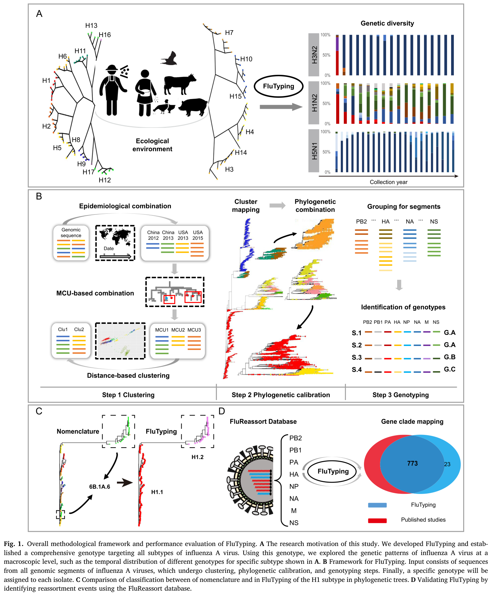
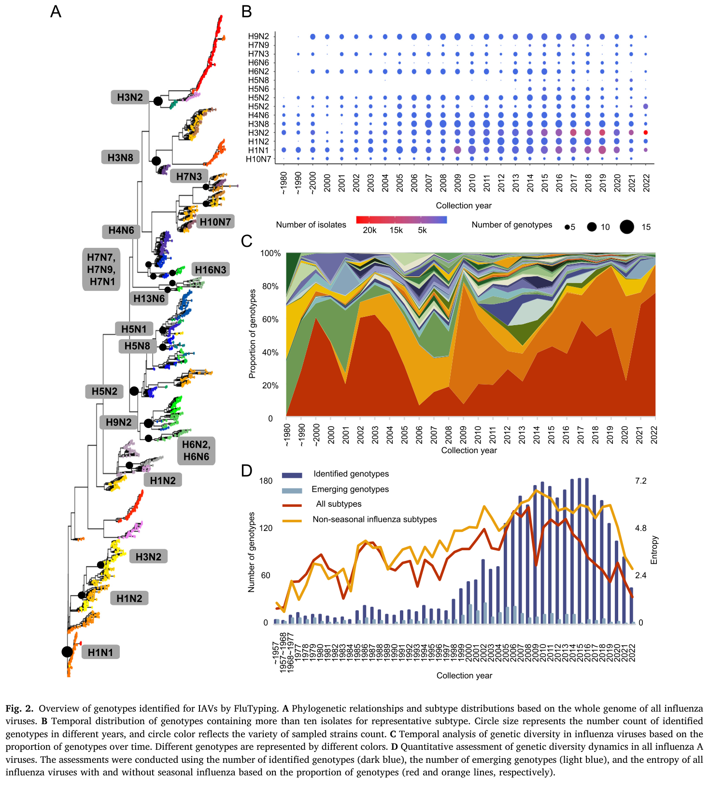
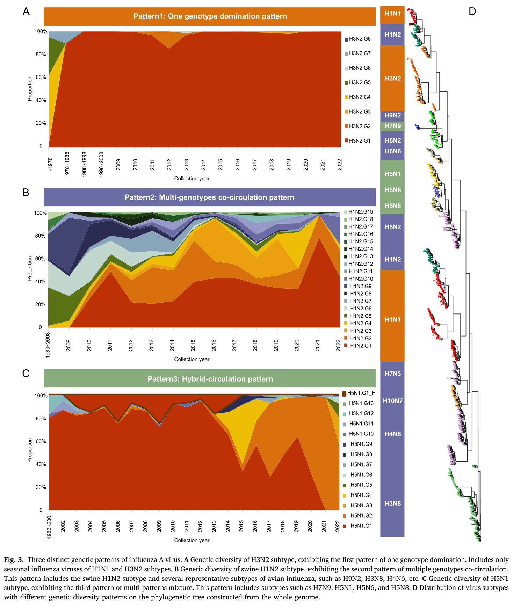
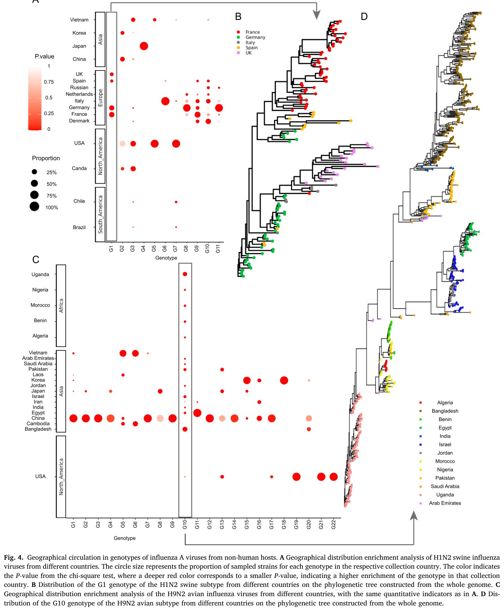
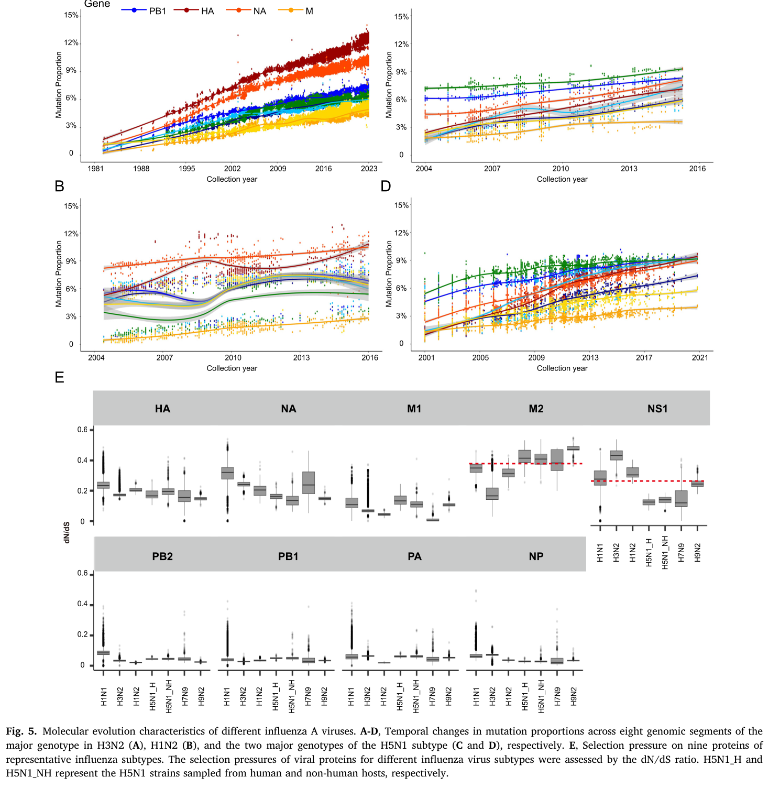

---
tags:
  - papers/流感进化与基因组学
aliases:
  - Ding et al. 2024 FluTyping
  - 甲流遗传多样性模式
date: 2024
doi: 10.1016/j.virs.2024.02.005
---

# Transmission restriction and genomic evolution co-shape the genetic diversity patterns of influenza A virus

## 核心信息

- 标题: Transmission restriction and genomic evolution co-shape the genetic diversity patterns of influenza A virus
- 标题翻译: 传播限制与基因组进化共同塑造甲型流感病毒的遗传多样性模式
- 作者: Xiao Ding, Jingze Liu, Taijiao Jiang, Aiping Wu
- 机构: 中国医学科学院/北京协和医学院苏州系统医学研究所；广州国家实验室；广州医科大学
- 发表时间: 2024
- 发表渠道: Virologica Sinica
- DOI: 10.1016/j.virs.2024.02.005
- 代码 / 项目: https://github.com/dingxiao8715/FluTyping
- 数据 / 资源: GISAID 数据库（133,249 全基因组）；GenBank
- 论文类型: 方法学/数据集 (benchmark_or_dataset)

## 原文摘要翻译

甲型流感病毒具有广泛的宿主范围和快速的基因组变异，导致具有显著抗原变异和跨物种传播潜力的新型病毒不断出现。这引发了全球大流行和季节性流感暴发，构成持续威胁。因此，研究所有甲型流感病毒的进化模式及其底层机制对于有效预防和控制至关重要。我们开发了 FluTyping 基因分型工具用于鉴定病毒基因型，以探索整体遗传多样性模式及其限制因素。该工具基于全基因组遗传距离和系统发育关系对分离株进行分组，能够鉴定每个分离株的基因型。我们观察到三种不同的遗传多样性模式：仅包括 H1N1 和 H3N2 季节性流感亚型的单一基因型主导模式、包括多数禽流感亚型和猪 H1N2 的多基因型共循环模式，以及包括 H7N9 和三种 H5 亚型的混合循环模式。此外，多基因型共循环模式中的病毒显示出区域特异性优势基因型，暗示病毒传播限制是导致不同遗传多样性模式的关键因素，且不同模式背后的基因组进化更多受宿主特异性因素影响。总之，该工具鉴定的基因型提供了整体甲型流感病毒进化模式的全面图景，为这些病毒的未来预防和控制提供了重要的理论基础。

## 创新点

1. **开发了首个面向所有 IAV 亚型的全基因组基因分型工具 FluTyping**：将遗传距离（高效性）与系统发育关系（准确性）相结合，通过"聚类→系统发育校准→基因分型"的三步框架，克服了传统方法（纯系统发育或纯遗传距离）的各自局限。每个分离株获得唯一的八段基因组合标识（如 5|2|6|H7.1|3|N7.2|3|1），实现了标准化的全局基因型命名。

2. **首次系统揭示了 IAV 的三种遗传多样性模式**：单一基因型主导（仅 H1N1 和 H3N2 季节性流感）、多基因型共循环（多数禽流感和猪 H1N2）和混合循环（H7N9 和 H5 亚型）。这一发现为理解不同生态场景下病毒进化策略的分化提供了宏观框架。

3. **确立了传播限制作为遗传多样性模式的核心塑造因素**：通过揭示非人类宿主 IAV 基因型的强烈地理结构，将传播的地理限制——而非基因组进化速率——确立为多基因型共循环模式的主要驱动因素。这在理论上区分了"病毒能进化出多少多样性"与"病毒能在哪里维持多样性"这两个不同的问题。

4. **提供了宿主特异性进化约束的系统性证据**：不同宿主（禽类、猪、人类）的 IAV 在突变速率、突变模式和选择压力上呈现显著差异，暗示宿主因素在塑造不同多样性模式的基因组进化中起关键作用。

## 一句话总结

本文开发了全基因组流感基因分型工具 FluTyping，将其应用于 13 万多个 IAV 基因组，系统揭示了三种遗传多样性模式，并确立了传播限制和宿主特异性进化是共同塑造这些模式的双重驱动力。

## 研究问题

甲型流感病毒具有 130 多种已知亚型、广泛的宿主范围、快速的基因组突变和频繁的片段重配。然而，过往研究主要集中于特定亚型或特定宿主中的特定病毒，缺乏对**整体 IAV 遗传多样性动态**的系统认知。本文试图回答三个核心问题：

1. 所有 IAV 的整体遗传多样性模式是什么？不同亚型的基因型结构是否存在系统差异？
2. 什么因素限制和塑造了这些多样性模式——是突变速率、重配频率、还是传播的地理限制？
3. 能否开发一个统一的全基因组基因分型框架，用于快速追踪新兴病毒和早期预警？

## 数据与任务定义

### 数据来源

- **初始数据**：GISAID 数据库中 2023 年 1 月前收集的 340,862 个甲型流感菌株全基因组序列
- **经过四步质控**：（1）去除长度偏离标准 >10% 或模糊碱基 >1% 的序列；（2）重复菌株仅保留最优序列；（3）仅保留有明确亚型、年份、国家和宿主信息的菌株；（4）仅保留含完整 8 个片段的基因组
- **最终数据集**：133,249 个高质量全基因组（八个片段：PB2、PB1、PA、血凝素、NP、神经氨酸酶、M、NS）
- **验证数据**：Nextstrain 的 H1 和 H3 代表性菌株；GenBank 的 H5 基因组序列；FluReassort 重配事件数据库

### 任务定义

- **基因分型**：将每个 IAV 分离株分配到由 8 个片段各自聚类结果组合而成的唯一基因型
- **模式发现**：基于基因型的时间动态和地理分布，识别宏观遗传多样性模式
- **因素分析**：通过比较不同模式的流行病学特征和基因组进化特征，探索塑造模式的因素

### 数据覆盖

数据集涵盖所有已知 IAV 亚型、所有主要宿主（人类、禽类、猪、其他哺乳动物）和全球所有主要地理区域。时间跨度覆盖数十年，以 2000 年后为主。

## 方法主线

### FluTyping 框架

FluTyping 由三个顺序步骤组成：

| 步骤 | 输入 | 操作 | 输出 |
|------|------|------|------|
| **聚类** | 各片段的所有序列 | 流行病学组合 → MCU 组合 → 距离聚类 | 每个片段的初步聚类 |
| **系统发育校准** | 初步聚类 + 系统发育树 | 人工合并混合聚类和异常值 | 优化后的聚类 |
| **基因分型** | 8 个片段的优化聚类 | 按八片段顺序组合（聚合酶 PB2、PB1、PA + 血凝素 + NP + 神经氨酸酶 + 基质蛋白 M + 非结构蛋白 NS） | 每个分离株的唯一基因型标识 |

### 聚类流程

**第一步：流行病学组合。** 按采集年份和国家将序列分组；对每组使用 CD-HIT 抽取代表序列（表面基因相似性截止 0.5%，内部基因 0.1%）；对代表序列用 FastTree 构建系统发育树。

**第二步：MCU 组合。** MCU（最小进化支单元）定义为系统发育树中仅包含叶节点的内部节点。两个 MCU 可合并的条件：
- 平均 MCU 内序列相似性 > **0.99**
- 合并后熵变 < **0.01**
- MCU 间无共享的单位特异性基因组位点

这三个参数的截止值通过系统评估确定——在 0.96–0.99（相似性）和 0.05–0（熵变）范围内搜索，选取准确率最高的组合。**最终准确率 99.68%**。

**第三步：距离聚类。** 使用贝叶斯信息准则（BIC）估计最优聚类数，然后应用层次聚类。

### 基因分型格式

```
- 示例：某分离株的基因型标识为各片段聚类编号的八段组合（依次对应 PB2、PB1、PA、血凝素、NP、神经氨酸酶、M、NS）
```

每个数字代表相应片段在聚类中的类别编号。表面基因（HA、NA）使用亚型前缀（如 H7.1、N7.2）以保留亚型信息。

### 实现

聚类和基因分型步骤用 Perl 脚本实现，代码公开在 GitHub（https://github.com/dingxiao8715/FluTyping）。


*Fig. 1: FluTyping 的整体方法框架与性能评估。（子图一）研究动机——开发面向所有甲型流感亚型的统一基因分型工具。（子图二）框架——输入为所有基因组片段序列，经历聚类、系统发育校准和基因分型三步。（子图三）H1 亚型在基因分型工具分类与传统命名法之间的系统发育树比较。（子图四）使用重配事件数据库验证工具的重配识别能力。*

> [!figure] Fig. S11 — H1、H3 和 H5 亚型的分类验证
> 建议位置：方法主线
> 放置原因：展示 H1、H3 和 H5 亚型在基因分型工具与传统命名法之间的详细比较验证。
> 当前状态：占位保留——提取图像因可视化质量门控被拒，无可供插入的可靠候选图像。

## 关键结果

### 代表性方向

#### 一、FluTyping 的验证

- 对 **H1、H3 和 H5** 三个代表性亚型进行了系统验证，FluTyping 分类与传统命名法高度一致，但在系统发育上更为精细（Fig. 1C）
- 使用 FluReassort 数据库（已知重配事件）验证了 FluTyping 识别重配的能力（Fig. 1D）
- H3N2 亚型拥有最多的分离株（63,915 个）和最多的基因型

#### 二、三种遗传多样性模式的发现

这是本文最核心的发现。基于基因型的时间动态（Fig. 3），IAV 分为三种模式：

| 模式 | 包含亚型 | 特征 | 生态解释 |
|------|---------|------|---------|
| **单一基因型主导** | H1N1、H3N2（人季节性流感） | 一种基因型在全球占绝对主导，随时间逐步替换 | 高效的全球传播使优势基因型迅速均质化 |
| **多基因型共循环** | 多数禽流感亚型、猪 H1N2 | 多种基因型同时在循环，呈现区域特异性 | 传播的地理限制使多种基因型在不同区域独立维持 |
| **混合循环** | H7N9、三种 H5 亚型 | 兼具上述两种模式的特征 | 可能因宿主范围有限或传播限制不完全 |

**关键观察**：自 2000 年以来，基因型多样性呈增加趋势。

#### 三、传播限制作为关键因素

多基因型共循环模式中，非人类宿主 IAV 的基因型呈现**强烈的区域特异性**（Fig. 4）：
- 同一地区的禽流感病毒拥有独特的基因型组合
- 不同大陆之间的基因型交换极为有限
- 区域优势基因型随时间动态变化，但始终维持区域特异性

相比之下，单一基因型主导模式（人类季节性流感）中，优势基因型可以**全球传播**——暗示高效的全球传播（航空旅行、人群流动）消除了区域差异。

#### 四、宿主特异性基因组进化

不同宿主中 IAV 的突变模式存在显著差异（Fig. 5）：
- **人类季节性流感病毒**：HA 和 NA 基因的突变速率最高，与抗原漂移一致
- **禽流感病毒**：内部基因片段（PB2、PB1、PA、NP）相对保守
- **猪流感病毒**：在特定片段上呈现独特的突变积累模式

这些差异暗示**宿主因素**（免疫压力、受体分布、细胞环境）在塑造基因组进化中起关键作用。特别值得注意的是，单一基因型主导和多基因型共循环两种模式背后的基因组进化速率并没有系统性差异——这意味着**传播限制而非进化速率是区分两种模式的主要因素**。


*Fig. 2: 基因分型工具鉴定的甲型流感病毒基因型概览。（子图一）各亚型的系统发育关系与亚型分布。（子图二）各亚型中鉴定的基因型数量——H3N2 拥有最多的基因型。（子图三）基因型多样性自 2000 年以来持续增加。（子图四）参与循环的基因型数量随时间变化的总体趋势。*


*Fig. 3: 甲型流感病毒的三种不同遗传模式。（子图一）H3N2 亚型的遗传多样性——单一基因型主导的典型例子，一种基因型在全球占绝对主导。（子图二）多基因型共循环模式——多种基因型同时在不同区域循环，呈现区域特异性优势基因型。（子图三）混合循环模式——H7N9 和特定 H5 亚型兼具上述两种模式的特征。*


*Fig. 4: 非人类宿主甲型流感病毒基因型的地理循环。（子图一）禽流感病毒基因型在全球各区域的地理分布，显示强烈的地理结构。（子图二）各区域优势基因型随时间的变化——区域特异性持续存在但并非静态。*


*Fig. 5: 不同甲型流感病毒的分子进化特征。（子图一至四）各亚型和宿主中突变速率随时间的动态变化——人类季节性流感病毒的血凝素和神经氨酸酶基因突变速率最高。（子图五至八）不同宿主和亚型中特定基因片段的选择压力差异。*

> [!figure] Fig. 2C、2D 与 Fig. S16 — 补充图表
> 建议位置：关键结果
> 放置原因：子图 2C 展示基因型多样性自 2000 年以来的增加趋势；子图 2D 展示涉及循环的基因型数量趋势；S16 展示不同基因型的时间分布。
> 当前状态：占位保留——无独立的可靠候选图像提取。

## 深度分析

### 核心论证链 1：FluTyping 的方法学合理性

**论证路径**：

现有方法局限（纯系统发育方法计算复杂且对重配不鲁棒；纯遗传距离方法缺乏进化信息）→ 需要结合两种方法的新框架 → FluTyping 的 MCU 组合 + 距离聚类 + 系统发育校准实现了两者的优势互补 → 99.68% 的验证准确率 → 与传统命名法一致但更精细。

**论证强度**：方法学设计逻辑自洽，参数选择有系统的截止值搜索支持。但验证主要基于与传统命名法的一致性——这是一种"黄金标准"验证策略，但传统命名法本身并非完美的参照（它也是人工构建的）。与 FluReassort 数据库的验证是更独立的外部验证，但其覆盖的重配事件有限。

**关键缺口**：基因型的功能意义（抗原性、致病性、传播性）未被实验验证。同一基因型内的病毒是否在生物学上也是均一的？这一问题的答案直接影响 FluTyping 基因型的实际应用价值。

### 核心论证链 2：三种模式 → 传播限制 + 宿主进化

**论证路径**：

- 人类季节性流感（H1N1、H3N2）→ 单一基因型全球主导 → 全球传播高效，消除区域差异
- 禽流感 → 多基因型区域共循环 → 传播受限于地理屏障和宿主生态
- H7N9 与 H5 → 混合模式 → 中间状态，可能反映不完全的传播限制

基因组进化速率在三种模式间无系统性差异 → 传播限制（而非进化能力）是区分模式的主要因素。

**论证强度**：三种模式的划分有清晰的数据支持，Fig. 4 的地理结构令人信服。但"传播限制 vs 基因组进化"的因果二分法可能过度简化——实际上两者可能以更复杂的方式交互。例如，禽流感病毒中某些基因型的区域优势可能反映了局部适应性（由基因组进化驱动），而非纯粹的传播限制。

### 核心论证链 3：宿主特异性进化约束

**论证路径**：

不同宿主物种的 IAV 呈现不同的突变模式和进化速率（Fig. 5）→ 宿主因素（免疫压力、受体分布、细胞环境）差异 → 基因型多样性的宿主特异性 → 不同宿主对整体 IAV 遗传多样性的贡献不同。

**论证强度**：宿主差异是清晰且可复现的。但在区分"宿主因素"和"传播模式"的各自贡献时，本文的分析是观察性而非实验性的。例如，人类 IAV 的高 HA 突变速率究竟是因为人类免疫压力更强，还是因为人类 IAV 经历了更多的传播轮次（更大的有效种群规模）？这两种解释很难仅从序列数据区分。

### 方法学的局限

- **人工校准步骤**：系统发育校准中的人工合并混合聚类和异常值，引入了主观性——不同研究者可能做出不同的校准决定。
- **参数普适性**：截止值（0.99 相似性、0.01 熵变）基于 H1、H3 和 H5 亚型确定——这些亚型恰好是数据最丰富的。这些截止值是否同样适用于数据更少、多样性更低的亚型（如 H14、H15）？尚未验证。
- **Perl 实现**：使用 Perl 脚本限制了工具的可维护性和社区贡献——Python 或 R 实现会更易于现代生物信息学社区采用。
- **静态基因型命名**：基因型是基于截至 2023 年 1 月的数据定义的——当新序列加入时，现有基因型的边界可能需要重新校准。

### 未覆盖区域

- 基因型与抗原性的关联——这是将 FluTyping 基因型转化为疫苗策略的前提
- 气候变化和人类活动（如城市化、农业集约化）对禽流感传播限制的影响
- 乙型和丙型流感病毒——它们是否也遵循类似的多样性模式？
- 宿主内基因型多样性与群体水平模式之间的关系

### 后续研究机会

1. **基因型-抗原性映射**：选择代表性基因型进行 HAI/中和实验，建立基因型与抗原性之间的定量关系——这是 FluTyping 从研究工具升级为公共卫生工具的关键。
2. **实时 FluTyping**：将 FluTyping 适配为实时运行的工具，自动将新提交的 GISAID 序列分配到已有基因型或标记为潜在新基因型。
3. **跨物种传播风险评估**：利用基因型框架量化不同基因型从禽类/猪类向人类跳跃的历史频率，建立风险评估模型。
4. **COVID-19 后比较**：用 FluTyping 分析 COVID-19 大流行前后的 IAV 多样性，检验大流行瓶颈是否改变了三种模式的分布。

## 局限

### 研究层面的局限

- **GISAID 数据偏差**：数据库存在已知的地理和宿主采样偏差（高收入国家、临床样本偏多），可能影响基因型多样性和地理结构的推断。特别是低资源国家和野生动物种群的甲流病毒多样性可能被严重低估。
- **因果推断的观察性本质**：传播限制和宿主进化的各自贡献是基于观察性比较推断的，无法进行随机化实验。可能存在未测量的混杂因素（如候鸟迁徙路线、家禽贸易网络）。
- **时间窗限制**：数据集截至 2023 年 1 月，COVID-19 大流行对病毒遗传多样性的影响未被纳入——已知大流行期间流感传播急剧下降，可能导致基因型多样性的瓶颈或转变。
- **基因型定义的可更新性**：基因型是基于现有数据集的聚类定义的——随着新数据的加入，基因型边界可能发生变化。尚不清楚基因型术语需要多频繁地重新校准。

### 方法学层面的局限

- **人工校准不可完全复现**：系统发育校准步骤中的人工决策可能在不同运行间产生差异
- **仅关注全基因组**：排除了大量仅有部分片段序列的菌株——这些菌株可能携带重要的多样性信息
- **序列质量依赖性**：基因分型结果依赖于高质量的序列比对——低质量或部分基因组可能导致错误的基因型分配

### 作者承认的局限

- FluTyping 需要人工校准某些复杂重配事件——全自动化仍是一个挑战
- 基因型的功能和表型意义需要在未来的实验研究中验证
- 三种模式的划分是基于当前数据——新的生态或进化场景可能产生额外的模式

## 我的笔记

### 这篇论文为什么值得保留

Ding 等人的这篇工作为甲型流感病毒提供了一个统一的全基因组基因分型语言。在我读过的流感文献中，每篇论文都有自己定义"基因型"的方式——有的基于 HA 序列聚类、有的基于系统发育分支命名、有的是临时的重配标识。FluTyping 提供了标准化的替代方案。这个工具的最大价值不在于方法学的新颖性（组合遗传距离和系统发育是合理的但非革命性的），而在于它第一次将"基因型"从亚型特异性的特设分类升级为跨亚型可比较的统一框架。三种遗传多样性模式的发现是由这个统一框架使能的——在之前的分亚型碎片化研究中不可能看到这个全局图景。

### 与相关文献的关系

- **本文对 Wille & Holmes (2020) 的生态框架提供了定量支持**：Wille & Holmes 提出了源-汇模型和重配驱动进化，而 FluTyping 用全基因组基因型数据为这些概念提供了分子层面的量化——例如，禽流感病毒的强烈地理结构即是"传播限制"在基因型层面的具体表现。
- **与 Han et al. (2023) 的互补**：Han 聚焦于人类流感的免疫-进化共进化，而本文提供了跨宿主、跨亚型的遗传多样性全景——两者结合构成了从"单个亚型如何进化"到"所有亚型如何共存和分化"的完整理解。
- **方法学前身**：Nextstrain 的命名法、GISAID 的进化支命名——FluTyping 是这些工作的自然延伸，提供了更自动化和跨亚型的一致性。

### 可以进一步追踪的方向

- FluTyping GitHub 仓库是否在持续更新和维护？（检查 commit 历史和 issue 响应）
- 是否有其他团队使用 FluTyping 进行独立的 IAV 多样性分析？（Google Scholar 引用追踪）
- 是否已有将 FluTyping 基因型与抗原性数据关联的研究？（搜索：FluTyping antigenic）
- COVID-19 后的 IAV 多样性研究——是否已用 FluTyping 分析了 2023-2025 年的新序列？

### 与我的研究关联

（根据个人研究方向补充）

## 引用

Ding X, Liu J, Jiang T, Wu A. Transmission restriction and genomic evolution co-shape the genetic diversity patterns of influenza A virus. *Virologica Sinica*. 2024;39:525–536. doi: [10.1016/j.virs.2024.02.005](https://doi.org/10.1016/j.virs.2024.02.005)
