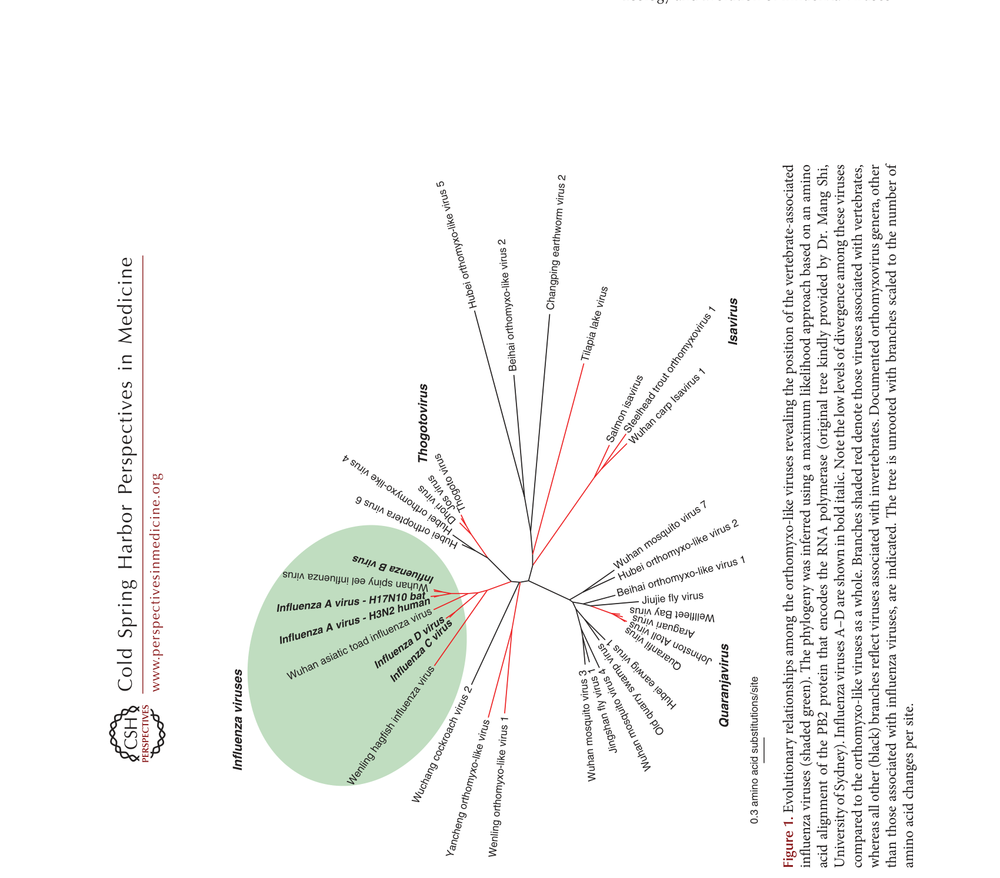
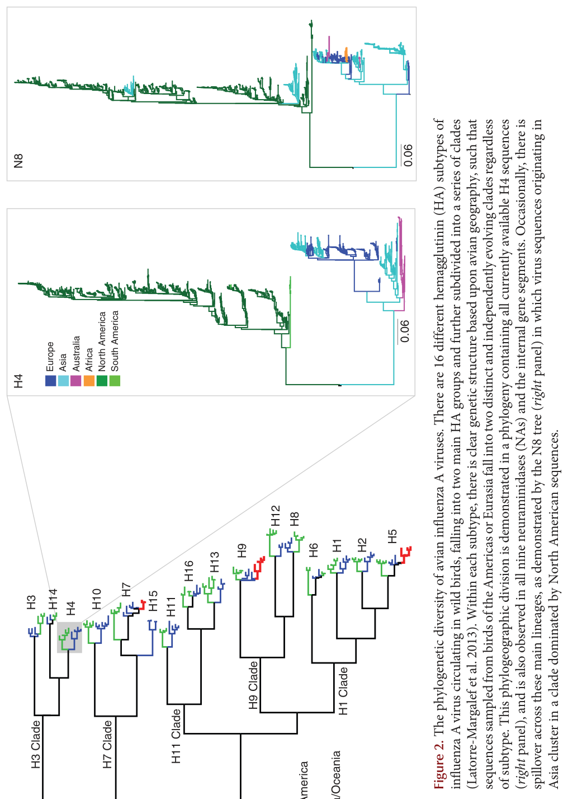
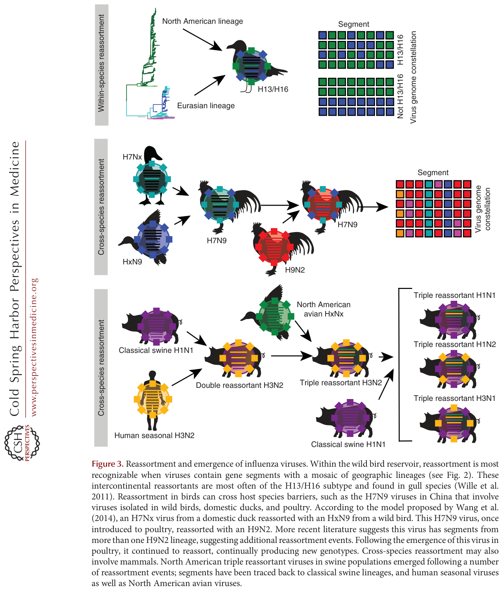
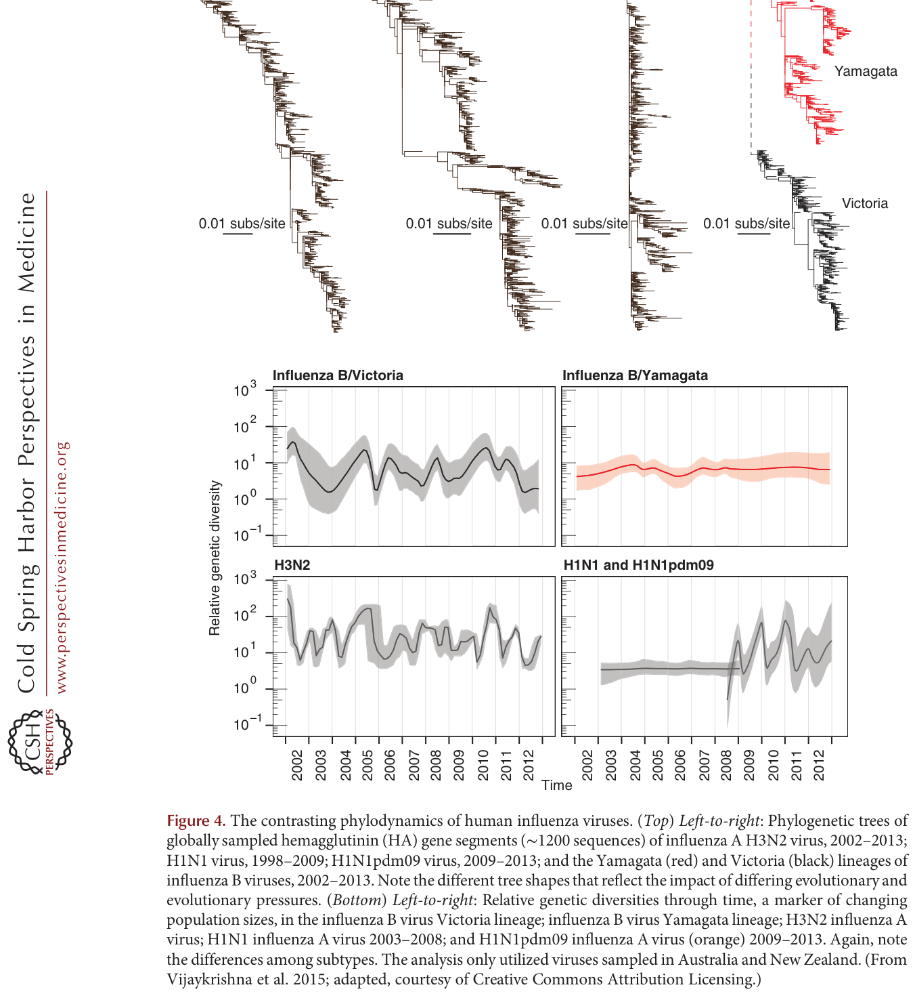

---
tags:
  - papers/流感进化与生态
aliases:
  - Wille & Holmes 2020 流感生态进化
  - 流感病毒的生态与进化综述
date: 2020
doi: 10.1101/cshperspect.a038489
---

# The Ecology and Evolution of Influenza Viruses

## 核心信息

- 标题: The Ecology and Evolution of Influenza Viruses
- 标题翻译: 流感病毒的生态与进化
- 作者: Michelle Wille, Edward C. Holmes
- 机构: WHO Collaborating Centre for Reference and Research on Influenza (The Peter Doherty Institute); The University of Sydney
- 发表时间: 2020
- 发表渠道: Cold Spring Harbor Perspectives in Medicine
- DOI: 10.1101/cshperspect.a038489
- 论文链接: https://doi.org/10.1101/cshperspect.a038489
- 论文类型: 综述 (survey_or_review)

## 原文摘要翻译

流感病毒进化的模式与过程具有根本性的重要意义，支撑着诸如在新宿主物种中出现的能力和快速产生抗原变异的能力等关键特征。本文回顾了流感病毒生态与进化的关键方面。我们从正黏病毒中流感病毒的起源出发，展示了宏基因组测序如何转变了我们对这些病毒进化历史的认知。随后，我们概述了不同物种中病毒亚型的多样性，以及这些病毒在新宿主中出现的过程，特别关注片段重配所起的作用。然后，我们记录了季节性甲型和乙型流感病毒在人群中的传播和系统动力学，包括抗原进化的驱动因素，最后以个体宿主尺度上的病毒多样性和进化讨论作结。

## 创新点

1. **以基因组学为中心统一流感病毒的生态与进化**：本文将宏基因组学的最新发现（无脊椎动物正黏病毒、蝙蝠流感、鱼类流感病毒）系统整合进流感病毒进化历史的叙事，从根本上重构了"流感病毒是鸟类-哺乳动物病毒"的传统认知，提出正黏病毒起源于无脊椎动物、流感病毒与脊椎动物共进化数亿年的新框架。

2. **将重配（而非渐进突变）确立为流感生态进化的核心驱动力**：本文系统论证了片段重配在禽流感病毒多样性维持、跨物种传播和人类大流行出现中的中心地位——这与人类流感中强调 HA 抗原漂移的传统视角形成互补和对比。

3. **提出并系统论证了人类流感病毒的源-汇（source-sink）全球传播模型**：通过系统动力学证据，将东亚和东南亚确立为人类流感病毒的持续性源种群，温带地区为季节性汇种群——这一模型对全球疫苗策略和监测资源分配有直接影响。

4. **跨越从病毒起源到宿主内进化的完整生态尺度**：从正黏病毒数亿年的宏进化到个体宿主在数天内的微进化，本文独特地在单一综述中覆盖了整个生态谱系，揭示了跨尺度模式之间的共性和张力（如时间尺度悖论）。

## 一句话总结

这篇综述以基因组视角贯穿从正黏病毒古老起源到宿主内进化微动力学的完整生态尺度，将宏基因组学革命性发现、禽流感动态多样性、跨物种传播的重配机制和人类流感的源-汇传播模型整合为一个统一的流感病毒生态-进化框架。

## 研究问题

流感病毒是研究最多的病原体之一——大量基因组数据已被生成，用于理解其遗传多样性、进化过程、起源和关键突变。然而，宏基因组测序的兴起从根本上改变了我们对流感病毒进化历史的认知。本文试图回答以下核心问题：

1. 流感病毒真正的进化起源是什么？它们在正黏病毒科中处于什么位置？
2. 禽流感病毒在野生水鸟储存库中维持着怎样程度的多样性，其进化模式如何不同于人类流感病毒？
3. 流感病毒如何跨越物种屏障出现于新宿主？重配在这一过程中起什么作用？
4. 人类季节性流感病毒如何在全球传播和持续进化？抗原进化的驱动机制是什么？
5. 宿主内进化过程——瓶颈、多样性水平和选择——如何影响病毒的长期进化？

## 数据与任务定义

### 综述范围

本文以**基因组学视角**为核心，覆盖流感病毒的完整生态尺度——从正黏病毒科的系统深层结构到流感病毒在个体宿主内的进化。宿主范围涵盖野生水鸟、家禽、猪、马、犬、蝙蝠、人类以及其他哺乳动物和脊椎动物。时间跨度从数亿年的共进化历史（宏基因组推断）到数天的宿主内动力学。

### 纳入/排除标准

- **纳入**：正黏病毒的系统发育和宏基因组研究；禽流感病毒在野生鸟类中的多样性和生态研究；流感病毒的跨物种传播事件（特别是大流行起源）；人类季节性流感病毒的系统动力学和抗原进化研究；宿主内流感病毒多样性的下一代测序研究。
- **排除**：详细的疫苗设计和开发（仅在抗原进化背景下讨论）；流感病毒分子生物学的详细机制（如聚合酶功能）；临床管理指南和治疗方案。

### 文献覆盖

综述引用了约 150 篇文献，涵盖宏基因组学、系统发育学、分子流行病学、系统动力学、生态学和进化生物学。证据类型从大规模宏转录组数据集到单个宿主的深度测序实验。关键的近年贡献包括：Shi 等人（2016, 2018）的无脊椎动物正黏病毒发现、Bedford 等人（2015）的全球系统动力学分析，以及 McCrone 等人（2018）的宿主内进化研究。

## 方法主线

### 分类体系

综述按**生态尺度的降序**组织，从最大时空尺度到最小：

- **正黏病毒的系统发育框架**（数亿年，所有宿主）→ 流感病毒在哪里？
- **禽流感病毒的种群多样性**（数十年至数百年，野生水鸟）→ 病毒如何在自然储存库中维持？
- **哺乳动物流感的出现**（数年至数十年，跨物种跳跃）→ 病毒如何跨越宿主屏障？
- **人类流感的系统动力学**（每年，全球人群）→ 病毒如何在人类中持续传播和进化？
- **宿主内进化**（数天至数周，个体）→ 病毒如何在一个感染周期内变化？

### 方法谱系

| 方法 | 应用 | 关键发现 |
|------|------|---------|
| 宏基因组/宏转录组测序 | 无脊椎动物和脊椎动物病毒组 | 正黏病毒的无脊椎动物起源 |
| 系统发育推断（ML/Bayesian） | 跨物种进化关系 | 流感病毒与宿主共进化数亿年 |
| 分子钟定年 | 进化时间尺度 | 速率约 10⁻³ 替换/位点/年，但仅追溯到 19 世纪 |
| 系统动力学（phylodynamics） | 全球传播和种群动态 | 东亚/东南亚源-汇模型 |
| 深度测序（宿主内） | 感染内的多样性和选择 | 瓶颈 <10 基因组，多样性低 |

### 证据组织方式

作者的核心叙事策略是**从系统发育树出发**——几乎每个主题都以一棵系统发育树为锚点：正黏病毒的 PB2 树（Fig. 1）→ 禽流感病毒的 HA 多样性树（Fig. 2）→ 跨物种重配示意图（Fig. 3）→ 人类流感的时间结构树（Fig. 4）。这种以树为基础的叙事使得病毒进化的层级性和历史性贯穿全篇。

## 关键结果

### 代表性方向

#### 一、正黏病毒的起源——从脊椎动物病毒到无脊椎动物家族

- 宏基因组测序彻底改变了正黏病毒的系统发育认知：**正黏病毒在无脊椎动物中具有巨大多样性**（蚊、蠼螋、蚯蚓、蟑螂、多种蝇类），表明该科起源于无脊椎动物、与动物界共进化了全部历史。
- 流感样病毒序列在**两栖动物、鱼类甚至七鳃鳗**（无颌脊椎动物）中被发现。PB2 系统发育总体上匹配宿主物种系统发育，暗示病毒与宿主**共进化了数亿年**。
- 野生水鸟（雁形目和鸻形目）是那些最终在人类中出现的甲型流感病毒的直接来源，但它们**仅是这个远更古老的进化历史中的里程碑**。
- 令人惊讶的是，人类乙型流感病毒目前最接近的亲属来自**鱼类（棘鳅）**——暗示乙型流感病毒可能也有远超人类历史的进化深度。

> 注：关于甲型流感病毒"近期起源"（分子钟定年仅追溯到 19 世纪）与"古老共进化"（宏基因组推断）之间的**时间尺度悖论**，见深度分析。

#### 二、禽流感病毒的巨大多样性与动态进化

- 野生水鸟携带 **16 种 HA 亚型和 9 种 NA 亚型**，秋季迁徙季感染率超过 20%，通常无症状。几乎所有可能的 HA-NA 组合都已被检测到。
- 禽流感病毒的进化高度动态：**片段重配极其频繁**（几乎每年检测到），谱系短暂——新的基因组星座持续出现和消失。这导致禽流感病毒的**系统发育树缺乏时间结构**（与人类流感形成鲜明对比）。
- 虽然 HA 和 NA 高度分化（不同的亚型），但**内部基因片段在亚型间显示出更多的同质性**——暗示不同亚型之间存在频繁的内部基因片段交换。
- NS 片段存在两类高度分化的等位基因，独立维持了数百万年。其中一类仅在鸟类中发现（称为 B 型等位基因），另一类则分布更广（A 型等位基因），暗示两者之间存在生态或功能分化——但其功能意义仍不清楚。

#### 三、跨物种传播与重配——流感病毒出现的核心机制

- 流感病毒的跨物种传播通常涉及**重配而非单个突变的适应**。禽流感病毒偶尔跨越到哺乳动物（猪、马、犬、人类），但建立持续传播链是罕见的。
- **猪**被认为是"混合容器"——因为猪同时感染禽流感和人类流感病毒的能力促进了重配，产生了抗原性新颖的病毒。2009 年甲型 H1N1pdm09 大流行毒株就是这样一个重配产物，包含了来自经典猪 H1N1、欧亚猪 H1N1、北美禽流感和人类 H3N2 谱系的基因片段。
- **马流感病毒**（H7N7 和 H3N8）提供了独特的自然实验：H7N7 似已灭绝；H3N8 在马中持续循环，但也在犬中建立了独立的传播循环——并经历了宿主特异性适应。
- 禽流感病毒在**家禽**中的适应（如高致病性 H5 和 H7 病毒）是在野生水鸟储存库之外的重要进化场景，但家禽很少是哺乳动物大流行毒株的直接来源。

#### 四、人类流感病毒的系统动力学——源-汇模型

- 人类甲型流感病毒（特别是 A/H3N2）的全球进化可以用**源-汇（source-sink）种群模型**描述。系统动力学证据表明，**东亚和东南亚是持续性的病毒源种群**——病毒在此持续循环和进化，然后季节性输出到全球其他（汇）种群（温带地区的季节性流行在本地灭绝后重新引入）。
- 这一模型的关键证据：系统发育树显示出**地理结构**（病毒首先在东亚/东南亚出现，然后扩散）；热带地区病毒持续循环；温带地区的病毒多样性在流行病之间经历强烈瓶颈。
- 甲型 H3N2 亚型的抗原进化速率远快于甲型 H1N1 亚型和乙型流感病毒。其血凝素的 HAI 抗原位点中**仅约 7% 的氨基酸差异**即可使新变体在抗原性上足够独特以逃逸人群免疫。这种快速抗原变化与源-汇动态共同驱动了 H3N2 相比于其他亚型的**更高疾病负担和更频繁的疫苗更新需求**。

#### 五、宿主内进化——瓶颈、多样性与抗药性

- 流感病毒的宿主内遗传多样性通常**很低**——大多数非同义突变仅在极低频率下被检测到，在传播时**很少被固定**。传播瓶颈极小（估计为 **1-10 个基因组**），充当了宿主内产生的多数变异的强过滤器。
- 免疫妥协个体的长期感染是例外——病毒种群可以在此类感染中积累突变并在潜在的选择压力下适应（包括抗原突变和抗药性突变）。
- 抗药性突变（如 NA 中的奥司他韦抗性突变 H275Y）在治疗期间可能被选择，但在**无药物压力时很少传播**——表明这些突变通常携带**适应性成本**。
- 宿主内多样性水平受**测序深度**和**采样策略**的强烈影响——低频率变异可能被标准的共有测序方法所遗漏。在单个宿主的多个解剖部位采集样本能揭示更多的多样性。

### 共识与分歧

**领域共识**：
- 正黏病毒起源于无脊椎动物，流感病毒与脊椎动物宿主共进化了漫长历史
- 禽流感病毒在野生水鸟储存库中通过频繁重配维持高度动态的基因组结构
- 跨物种传播是流感病毒出现的主要机制，重配是其中的核心过程
- 东亚和东南亚是 A/H3N2 病毒全球传播的关键源种群
- 传播瓶颈极小，纯化选择主导宿主内进化

**尚未解决的分歧**：
- 时间尺度悖论——流感病毒真的有数亿年历史吗？如果是，为什么分子钟只追溯到 19 世纪？
- NS 片段两类等位基因的功能差异——其中一类等位基因为什么仅限于鸟类？
- 禽流感病毒在野生水鸟中是否经历有意义的抗原漂移？
- 源-汇模型是否适用于 A/H1N1 和乙型流感病毒？
- 宿主内产生的低频率突变在多大程度上贡献于全球进化？

### 开放问题

1. 选择性清除假说——19 世纪是否发生了一次全局性的优势突变固定事件——能被直接验证吗？
2. 无脊椎动物正黏病毒是否具有感染脊椎动物的潜能？
3. 为什么禽流感病毒的 16 种 HA 亚型在抗原上是稳定的，而人类 H3N2 病毒的 HA 在短短数年内就经历实质性抗原漂移？
4. 乙型流感病毒的生态学和进化起源——为什么如此难以追踪？
5. 能否利用源-汇模型优化全球疫苗策略——在源种群而非汇种群中优先接种？

## 深度分析

### 核心论证链 1：宏基因组学 → 正黏病毒的无脊椎动物起源 → 流感-脊椎动物共进化

这是本文最具变革性的论证。证据链：

宏基因组/宏转录组采样 → 在多种无脊椎动物（蚊、蚯蚓、蟑螂等）中检测到正黏病毒 → 无脊椎动物正黏病毒的系统发育多样性远超脊椎动物相关支系 → 脊椎动物正黏病毒在无脊椎动物病毒多样性中形成多个插入支系 → 因此正黏病毒起源于无脊椎动物、多次跳跃至脊椎动物。

与此同时：在两栖动物、鱼类和七鳃鳗中检测到流感样病毒 → PB2 系统发育总体与宿主系统发育一致 → 流感样病毒与脊椎动物宿主共进化了全部或大部分脊椎动物历史（>5 亿年）。

**论证强度**：系统发育证据令人信服——多个独立研究使用不同数据集得到了相同结论。但关键注意：共进化推断基于"病毒系统发育匹配宿主系统发育"这一模式，这一模式可能被未观察到的宿主跳跃事件所混淆。此外，这些"流感样病毒"中仅少数被分离为活病毒——它们的生物学特性（宿主嗜性、致病性、传播模式）几乎完全未知。

### 核心论证链 2：频繁重配 + HA-NA 功能平衡 → 禽流感病毒的高度动态基因组结构

证据链：

野生水鸟的禽流感病毒系统发育树缺乏时间结构 → 不同亚型的内部基因高度同质 → 重配频率极高（几乎每年检测） → 基因组星座短暂 → 但 HA 和 NA 亚型之间保持高度序列分化 → HA-NA 功能平衡约束可能限制了特定 HA-NA 组合的适应性。

**论证强度**：重配频率的流行病学证据充分。但血凝素-神经氨酸酶功能平衡假说主要基于相关性和体外实验——在野生鸟类群体中直接测量配对的适应性极其困难。NS 片段的 A 型与 B 型等位基因独立维持数百万年暗示存在强功能约束，但其具体机制仍未知——这是自然选择维持多态性的罕见案例。

### 核心论证链 3：源-汇种群结构 → 东亚/东南亚作为流感进化的引擎

证据链：

全球病毒序列的系统发育分析 → A/H3N2 病毒首先在东亚/东南亚出现 → 然后向全球扩散 → 温带地区病毒多样性在流行病之间经历季节性瓶颈 → 热带地区病毒更持续地循环 → 因此东亚/东南亚的人口和气候条件维持了持续的病毒传播链，作为全球的"进化引擎"。

**论证强度**：对于甲型 H3N2 亚型，证据是强有力的和多方面的。但这引出了一个更深刻的问题——**为什么**是东亚/东南亚？是气候（更有利于持续传播）、人口密度、高出生率（更多免疫幼稚个体）、还是这些因素的组合？此外，COVID-19 大流行从根本上扰乱了全球流感传播——这是否改变了源-汇结构尚待观察。对于甲型 H1N1 亚型和乙型流感，源-汇模型的适用性较弱——它们的系统发育结构更复杂。

### 时间尺度悖论——综述最深层的未解张力

本综述呈现了一个贯穿全篇的深层张力：宏基因组学暗示流感病毒与脊椎动物共进化了 >5 亿年，但分子钟定年将现有禽类和哺乳动物流感病毒的遗传多样性追溯至多约 150-200 年（约至 19 世纪）。本文提到一种"选择性清除"假说——19 世纪的某个优势突变（可能涉及 HA 或 NA）扫除了更古老的遗传多样性——但这一假说缺乏直接证据。如果选择性清除真的发生了，是什么驱动了它？为什么全局性的清除似乎同步发生在如此多不同的亚型和宿主物种中？这一张力不仅是流感病毒进化中的核心谜题，也是分子进化生物学普遍面临的方法论挑战。

### 分类体系的局限

1. **禽类与哺乳动物之间的人为二分**：综述用鸟类 vs 哺乳动物作为组织框架，但现代宏基因组学揭示了一个远更连续和复杂的宿主谱系（无脊椎动物 → 原始脊椎动物 → 鸟类/哺乳动物）。鸟类-哺乳动物的二分法掩盖了这一连续性。
2. **抗原进化的不对称关注**：人类流感病毒的抗原漂移被详细讨论，但禽流感病毒中抗原漂移的存在、速率和机制几乎未被讨论——这反映了数据可得性而非生物学差异。
3. **生态与进化的不平衡**：综述标题为"生态与进化"，但实际上进化分析（系统发育、系统动力学）的深度远超生态学分析（传播动力学、环境持久性、季节性驱动因素）。

### 未覆盖区域

- 流感病毒在环境中的持久性和环境传播途径（水传播在野生鸟类中至关重要）
- 流感病毒的种间竞争（如人类 H1N1 和 H3N2 之间的生态动力学）
- 气候变化对流感病毒生态和进化的可能影响
- 乙型和丙型流感病毒的生态学——它们的储存库和跨物种潜力几乎未知

### 后续研究机会

1. **功能验证无脊椎动物正黏病毒**：分离和表征来自无脊椎动物的正黏病毒以测试其感染脊椎动物细胞的能力，是评估大流行潜力的关键一步。
2. **解决时间尺度悖论**：使用古病毒学（从历史样本中恢复古老病毒序列）或替代的分子钟模型来检验选择性清除假说。
3. **野外禽流感抗原性研究**：开发高通量方法以在野生水鸟中大规模表征禽流感病毒的抗原性——填补当前知识的最大缺口。
4. **源-汇模型的机制基础**：确定气候、人口和免疫因素中哪些驱动东亚/东南亚成为持续性的源种群——为干预策略提供基础。

*Figure 1: 正黏病毒样病毒的进化关系，揭示脊椎动物相关流感病毒（绿色阴影）在整体正黏病毒多样性中的位置。基于 PB2 蛋白氨基酸序列的最大似然系统发育。甲、乙、丙、丁四型流感病毒以粗斜体显示。红色分支表示与脊椎动物相关的病毒；黑色分支表示与无脊椎动物相关的病毒。注意流感病毒内部极低的遗传分化程度，与正黏病毒样病毒整体巨大分化程度形成鲜明对比。*

*Figure 2: 禽流感病毒的血凝素系统发育多样性。展示了在野生水鸟中发现的 16 种血凝素亚型（第 1 至第 16 型）以及蝙蝠中发现的第 17 和第 18 型。每个亚型内部存在相当大的序列多样性，但亚型之间的分化更为巨大——不同亚型的血凝素氨基酸序列可能差异超过 30%。*

*Figure 3: 流感病毒的重配与出现。在野生鸟类储存库中，不同亚型之间频繁发生片段重配，产生新的基因组星座。偶尔，这些重配病毒跨越物种屏障进入家禽或哺乳动物（包括人类），可能通过中间宿主如猪——猪被认为是禽流感病毒和人类流感病毒的"混合容器"。*

*Figure 4: 人类流感病毒的系统动力学对比。（上排）从左至右：甲型 H3N2 亚型的系统发育树显示出清晰的时间结构和快速的抗原进化；甲型 H1N1pdm09 亚型显示出较慢的抗原进化速率。（下排）乙型流感 Victoria 和 Yamagata 谱系的系统发育树，各自具有较慢的抗原进化速率和不同的系统动力学模式。*

## 局限

### 综述层面的局限

1. **采样偏差严重**：禽流感病毒的数据绝大多数来自北欧和北美迁徙路线的野生水鸟，以及中国的家禽市场。南半球温带、非洲和南美洲的禽流感病毒数据极为匮乏——这些区域的多样性可能显著不同于已充分采样的区域。
2. **功能研究的缺乏**：宏基因组学发现的大量新型正黏病毒几乎全为序列数据，其宿主嗜性、致病性和传播潜力完全未知——综述对"多样性"的宣称本质上基于序列同源性。
3. **禽类抗原进化知识的严重不足**：综述对人类流感抗原漂移的讨论相对丰富，但对禽流感病毒抗原进化的讨论几乎空白——这不是作者的疏漏，而是该领域根本没有足够的数据。
4. **时间框架的不对称**：综述对近期进化（数年至数十年）的讨论远超对古老进化（数百万年）的讨论——这在方法论上是合理的（近期数据更丰富），但在叙事上造成了深度与广度之间的不平衡。

### 综述所回顾证据的共性局限

1. **序列与生物学的鸿沟**：绝大多数综述证据来自基因组序列，对这些病毒的实际生物学（细胞嗜性、宿主范围、致病机理）的理解非常有限。
2. **系统发育推断的固有假设**：共进化推断依赖于"系统发育匹配"模式，但这一模式可能受到未检测到的宿主跳跃和灭绝事件的影响。
3. **源-汇模型的静态性**：系统动力学模型假设了相对稳定的传播结构，但全球旅行模式、疫苗覆盖率和气候在数十年尺度上都在变化——模型的预测能力有待检验。
4. **宿主内测序的灵敏度限制**：低频率变异的检测强烈依赖于测序深度，标准共有测序会遗漏可能的低频适应性变异。

### 作者承认的局限

- 时间尺度悖论仍然未解决——选择性清除假说只是一个假说
- NS 片段 A 和 B 等位基因的功能差异仍不清楚
- 禽流感病毒在野生鸟类中是否经历有意义的抗原漂移——未知
- 宏基因组学发现的病毒的功能表征仍极其有限

## 我的笔记

### 这篇论文为什么值得保留

Wille 和 Holmes 的这篇综述提供了流感病毒进化最宏观的视角——从正黏病毒在无脊椎动物中的古老起源到人类季节性流感病毒在单个宿主内的微观进化。它与 Han et al. (2023) 的免疫共进化综述形成互补：Han 侧重于"人类免疫如何驱动病毒进化"（近端因果），而这篇文章侧重于"病毒从何而来、如何在生态系统中维持和传播"（终极因果和生态框架）。两篇结合起来，构成了对流感病毒进化的完整理解。

### 与相关文献的关系

- **Han et al. (2023)** Nature Reviews Microbiology: 侧重于免疫共进化和控制手段——与本文互补，本文提供后者所缺乏的生态和宏基因组学背景。
- **Shi et al. (2018)** Nature: 无脊椎动物正黏病毒的原始发现——这篇综述将这一发现嵌入更广泛的理论框架。
- **Bedford et al. (2015)** Nature: 系统动力学源-汇模型的原始工作——本文对该模型进行了综合评估。
- **McCrone et al. (2018)** eLife: 宿主内流感病毒进化的系统综述——本文在其基础上添加了跨宿主背景。

### 可以进一步追踪的方向

- 无脊椎动物正黏病毒的功能表征研究（PubMed 搜索：orthomyxovirus invertebrate characterization）
- 禽流感病毒在野生鸟类中的抗原性研究（目前几乎无文献）
- 东亚/东南亚流感监测的最新系统动力学分析（搜索：phylodynamics source-sink influenza）
- 选择性清除假说的最新证据（搜索：influenza selective sweep timescale）
- 气候变化对禽流感传播的影响（搜索：climate change avian influenza migration）

### 与我的研究关联

（根据个人研究方向补充）

## 引用

Wille M, Holmes EC. The Ecology and Evolution of Influenza Viruses. *Cold Spring Harbor Perspectives in Medicine*. 2020. doi: [10.1101/cshperspect.a038489](https://doi.org/10.1101/cshperspect.a038489)
