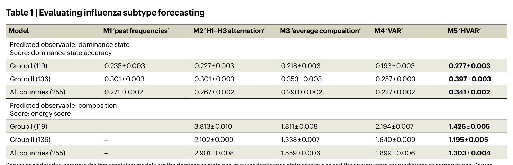
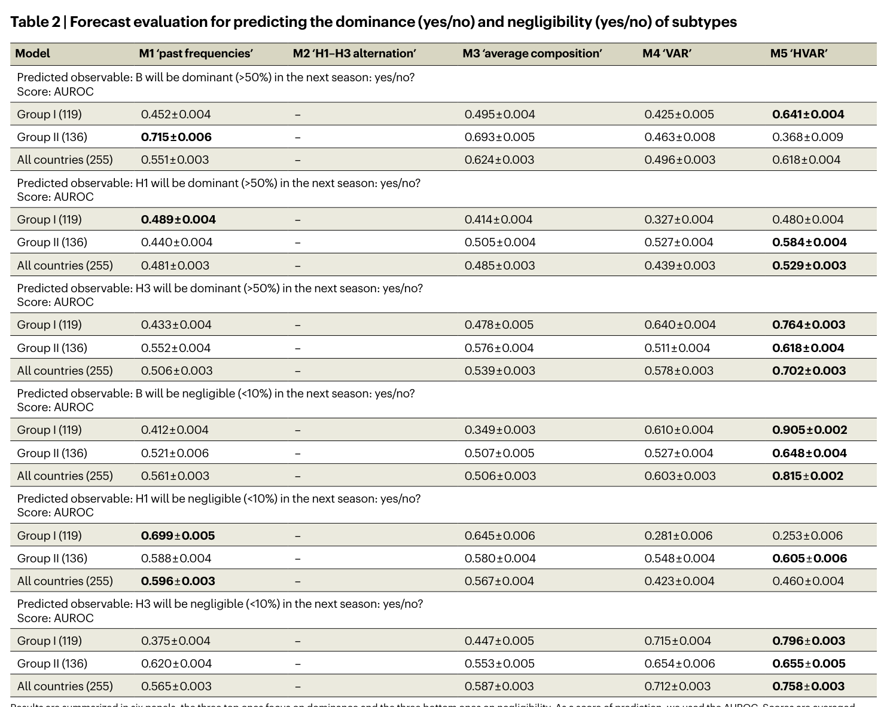
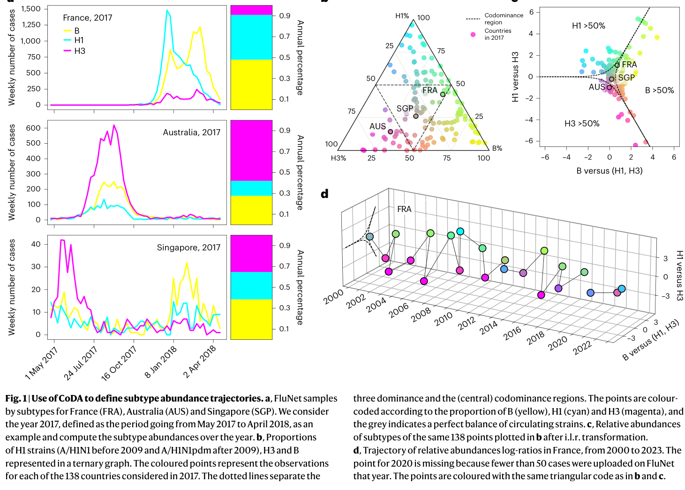
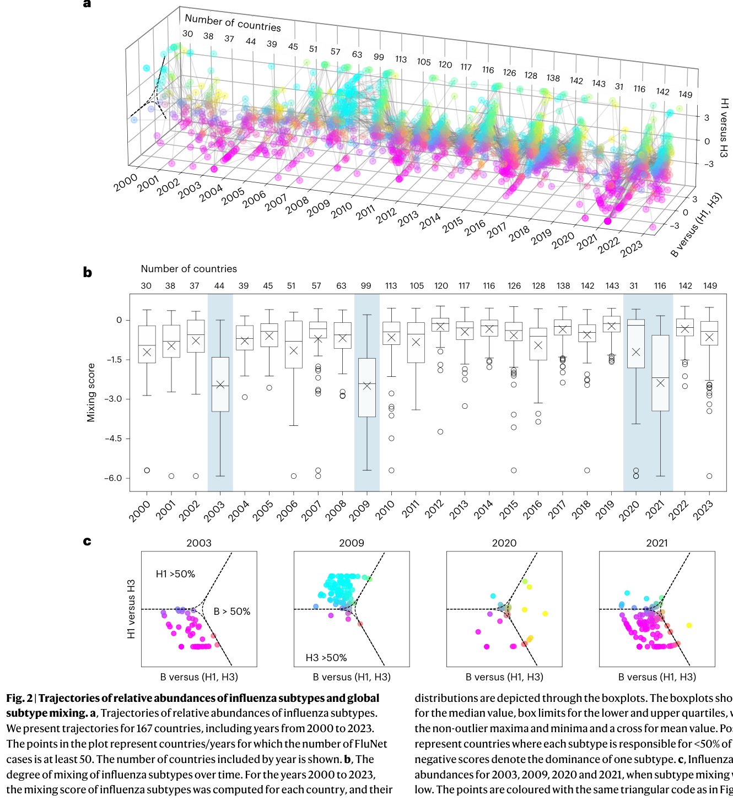
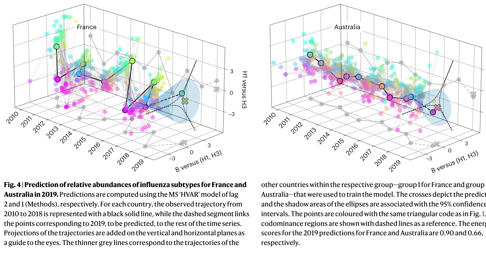

---
tags:
  - papers/epidemiology
  - papers/computational-biology
aliases:
  - Bonacina2026 Flu Subtype Dynamics
  - 全球流感亚型组成预测
date: 2026
doi: 10.1038/s44360-026-00069-2
---

# Characterization and Forecast of Global Influenza Subtype Dynamics

## 核心信息

- 标题: Characterization and forecast of global influenza subtype dynamics
- 标题翻译: 全球流感亚型动态的特征刻画与预测
- 作者: Francesco Bonacina, Pierre-Yves Boëlle, Vittoria Colizza, Olivier Lopez, Maud Thomas, Chiara Poletto
- 机构: Sorbonne Université (INSERM), CREST/Institut Polytechnique de Paris, Université Claude Bernard Lyon 1, University of Padova, Bocconi University
- 发表时间: 2026
- 发表渠道: Nature Health
- DOI: 10.1038/s44360-026-00069-2
- 论文链接: https://doi.org/10.1038/s44360-026-00069-2
- 代码 / 项目: https://github.com/FrancescoBonacina/coupled-dynamics-flu-subtypes/
- 数据 / 资源: FluNet (https://www.who.int/tools/flunet); IATA航空数据(商业); 气象数据来自Climate Data Store
- 论文类型: 计算方法型流行病学研究（CoDA框架 + HVAR预测模型）

## 原文摘要翻译

季节性流感波的亚型组成随空间和时间变化。甲型H1N1、甲型H3N2和B型流感对不同人群的影响存在差异；因此，理解其共循环的驱动因素并预测其组成对疫情防控准备至关重要。FluNet提供了超过150个国家的流感样本亚型数据。然而，由于各国监测体系的差异，全球分析通常聚焦于亚型组成（百分比数据），这类数据难以用高级统计方法处理。

我们采用成分数据分析（CoDA）来规避这一问题，研究各国年度亚型组成的轨迹。本文首先分析了2000至2023年的全球趋势，识别出若干因新病毒或进化支接管（2003/2004季的甲型H3N2优势、2009年甲型H1N1pdm大流行）或亚型空间隔离（COVID-19大流行期间）而导致国家内部亚型高度优势的异常季节。其次，我们证明地理因素——尤其是国际人员流动——在2010至2019年间共同塑造了各国的组成轨迹。这些轨迹聚为两个宏观区域，分别以亚型交替和持续混合为特征。

最后，我们定义了五种预测下一年亚型组成的算法，发现将全球亚型组成历史纳入贝叶斯层级向量自回归（HVAR）模型后，预测效果优于简单方法。对全球流感亚型时空动态的联合分析揭示了亚型循环中隐藏的结构，该结构可用于改进对各地下一年疫情亚型组成的预测。

## 创新点

1. **CoDA框架首次系统应用于全球流感流行病学**：成分数据分析在地质学和生态学中常用，但在传染病流行病学中极为罕见。本文首次将isometric log-ratio (ilr) 变换引入流感亚型百分比数据的分析，解决了sum-to-one约束导致的标准统计方法失效问题。这为所有多病原体/多毒株百分比数据的分析提供了通用范式。

2. **mixing score——简洁且可解释的亚型混合度量**：作者定义了从ilr坐标到codominance边界的带符号最短距离作为mixing score，将"亚型多样性"从一个模糊的概念转化为连续的定量指标。该指标的上界0.56对应三等分、负值对应单亚型优势，直观可解释，可直接用于监测系统。

3. **HVAR模型首次用于亚型组成预测，利用空间结构改进预测精度**：作者将贝叶斯层级向量自回归模型应用于CoDA变换后的轨迹数据，通过聚类共享群内VAR参数（$B_c = W + V_c$），克服了单国时间序列过短（7-9年）的限制。这是在1年预测尺度上对流感亚型组成的首个系统性建模尝试。

## 一句话总结

本文用成分数据分析（CoDA）框架处理FluNet的167国流感亚型百分比数据，发现航空旅行驱动的双macroregion空间结构（交替型 vs 混合型），并通过贝叶斯层级VAR模型（HVAR）利用该结构将下一年亚型组成预测精度提升至超越所有简单基线方法。

## 研究问题

### 核心问题

甲型H1N1pdm、甲型H3N2和B型流感在全球各国以不同的比例共循环，其组成影响疫情的严重程度、年龄分布和持续时间。然而，三个关键问题尚未得到系统性解答：

1. 各国亚型组成的时空动态由什么因素驱动？
2. 全球范围内是否存在可识别的空间结构？
3. 能否在一年前预测某个国家的亚型组成？

### 方法瓶颈

亚型组成数据是百分比数据，三个组分的和为1，导致组分间存在固有的负相关（sum-to-one约束），标准统计方法（如线性回归、VAR）在这种数据上会给出误导性结果。此前的研究要么聚焦单一亚型的系统地理学，要么限制在单一区域的alternation模式描述，缺乏对三种亚型耦合动力学的全球联合分析。

### 预测空白

流行病学预测领域主要关注1-4周的短期发病率预测（FluSight/Scenario Modeling Hub），或利用抗原信息预测clade水平的病毒进化（Luksza-Lässig/Neher方法）。但国家层面、1年尺度的亚型组成预测几乎无人涉足——而这对疫苗分配、医院资源规划和目标人群保护至关重要。

## 数据与任务定义

### 数据来源

| 数据类型 | 来源 | 说明 |
|---------|------|------|
| 流感监测数据 | WHO FluNet | 2000-2024年，167国，周度阳性样本数按亚型/B型谱系分类 |
| 航空旅行数据 | IATA | 国家间航空旅客数（商业数据） |
| 气象数据 | Climate Data Store | 各国平均温度和相对湿度 |
| 人口数据 | United Nations WPP/WUP | 国家人口和城市群人口 |

### 数据预处理

- **年度聚合**：从每年第17周（4月底）开始至次年4月，最小化跨年拆分疫情的风险
- **纳入阈值**：国家/年至少50个阳性样本（敏感性分析中测试了500样本阈值）
- **A型未分型样本处理**：按当周已分型A样本的H1/H3比例分配；若当周无分型，则在前后5周或全年范围内查找比例
- **零值处理**：使用zCompositions包的Geometric Bayesian-multiplicative方法替代零值（ilr变换在零组分处无定义）
- **哨兵/非哨兵合并**：验证两者亚型比例相似后合并使用

### 任务定义

**预测目标**（三种粒度）：

1. **优势状态**（dominance state）：四分类——B优势、H1优势、H3优势、共优势（codominance）

2. **组成向量**（composition）：连续二维ilr坐标，对应(B%, H1%, H3%)三个百分比

3. **二元预测**：每个亚型是否优势（>50%）或是否可忽略（<10%）

**预测框架**：用2010年至预测年前一年的数据训练，预测2017、2018、2019三年的亚型组成。共85个国家 × 3年 = 255个预测样本。

## 方法主线

### 机制流程

```text
步骤1: 原始FluNet周度数据
  ├── 输入: 每周各国B/H1/H3阳性样本数
  ├── 操作: 年度聚合(May-Apr) → 计算百分比 → 零值替代
  └── 输出: (B%, H1%, H3%) 三元组向量

步骤2: isometric log-ratio (ilr) 变换
  ├── 输入: sum-to-one约束的三元组 (B%, H1%, H3%)
  ├── 操作: ilr映射至二维无约束Euclidean坐标
  │   u = √(2/3) · ln(B% / √(H1%·H3%))
  │   v = √(1/2) · ln(H1% / H3%)
  └── 输出: (u, v) 坐标 → 形成各国家的年度轨迹

步骤3: 轨迹分析与空间聚类
  ├── 输入: 86国2010-2019年轨迹
  ├── 操作:
  │   - 计算mixing score = 到codominance边界的带符号最短距离
  │   - 计算国家对轨迹间的平均Euclidean距离
  │   - Mantel检验 + 多变量回归分析地理预测因子
  │   - Ward层次聚类 + Silhouette系数选择最优聚类数
  └── 输出: Group I (41国, alternation型) 和 Group II (45国, 混合型)

步骤4: HVAR预测
  ├── 输入: 各群内国家的ilr轨迹训练集
  ├── 操作:
  │   - 对每个群独立拟合HVAR模型
  │   - B_c = W + V_c（群平均 + 国家调整）
  │   - Gibbs采样进行最大似然估计
  │   - Group I用lag=2, Group II用lag=1
  └── 输出: ŷ_{T+1} 预测分布 → 逆ilr映射回百分比
```

### 五种预测算法详述

**M1「历史频率」**：预测下一年优势状态 = 训练期出现频率最高的优势状态（如有并列则随机选择）。仅预测优势状态，不预测组成。

**M2「H1-H3交替」**：基于H1和H3倾向于交替出现的证据，将前一年组成中H1%与H3%互换，B%保持不变。即：

$$\hat{y}_{T+1} = (u, -v)_T$$

对应百分比形式：B%不变，H1%与H3%互换。

**M3「平均组成」**：预测为训练期所有年份ilr坐标的算数平均：

$$\hat{y}_{T+1} = \frac{1}{T}\sum_{t=1}^{T} y_t$$

置信区间由协方差矩阵给出。

**M4「VAR」**：拟合lag=1的向量自回归模型：

$$y_t = \nu + A^{(1)}y_{t-1} + \epsilon_t$$

使用最小二乘估计 $\hat{B} = YZ'(ZZ')^{-1}$ 获得系数矩阵。仅使用lag=1，因为在最短的训练集上（2010-2016，T=7）当p>1时协方差矩阵估计量未定义。

**M5「HVAR」**：贝叶斯层级VAR。关键层级结构：

$$B_c = W + V_c$$

W是群平均行为系数矩阵，V_c是国家个体调整矩阵。W、V_c和噪声U_c的元素为独立随机变量，由潜在变量参数化的分布采样。使用Gibbs采样器进行最大似然估计（基于Lu等人2018的代码修改，添加了截距项）。Group I使用lag=2，Group II使用lag=1（根据各群的最低energy score选择）。

### Mixing Score 的定义

mixing score是ilr平面中点 $(u, v)$ 到codominance区域边界的最短距离：
- **正值**（组成在codominance区域内）：每个亚型均 <50%
- **负值**（组成在codominance区域外）：一个亚型占优势
- **上界**：0.56（对应三等分，即(B%, H1%, H3%) = (33.3%, 33.3%, 33.3%)）
- **无下界**：如单亚型 >75% 时约 < -0.8

codominance边界由单纯形中H1%=50%、H3%=50%或B%=50%的点经ilr映射后确定：

$$v(u) = \sqrt{2}\left(\ln\left(e^{u\sqrt{3/2}} + \sqrt{e^{u\sqrt{6}} + 4}\right) - \ln 2\right)$$

### 评估指标

| 指标 | 适用对象 | 方向 | 说明 |
|------|---------|------|------|
| Dominance state accuracy | 优势状态（四分类） | 正（越大越好） | 正确预测的比例 |
| Energy score | 组成向量（连续） | 负（越小越好） | CRPS的多元推广 |
| AUROC | 二元预测（是/否） | 正（越大越好） | 0.5=随机，1.0=完美分离 |

Energy score公式（F为预测分布，y为观测值，N为样本数）：

$$\text{ES}(F, y) = \frac{1}{N}\sum_{i=1}^{N} \|X_i - y\| - \frac{1}{2N^2}\sum_{i=1}^{N}\sum_{j=1}^{N} \|X_i - X_j\|$$

所有指标均通过200次bootstrap计算均值的标准误。

## 关键结果

### 全球多年度趋势：mixing score识别异常年份

- **2003年**：A/H3N2在35/44国（80%）中>75%优势 → 新兴进化支导致疫苗效果有限
- **2009年**：A/H1N1pdm在82/99国（83%）中>75%优势 → 人畜共患溢出和大流行
- **2020-2021年**：亚型空间隔离增强 → COVID-19接触和旅行限制导致（仅31国在2020年报告≥50样本）
  - 2020年：A/H3N2在7个东南亚国家占优势，B在3个热带国家和中国/阿富汗占优势，A/H1N1pdm主要在5个非洲国家
  - 2021年：83/116国出现单亚型强优势

这些年份的共同特征：由病毒的**点状变化**（新进化支/新亚型）或**外部冲击**（大流行防控措施）触发全球尺度的异常事件。

### 地理格局：航空旅行驱动的双macroregion结构


*Table 1: 五种预测模型的性能比较（dominance state accuracy和energy score）。M5 HVAR在所有指标上表现最优。*

**Mantel检验和回归分析结果**（2010-2019，86国）：

| 预测因子 | 效应 | 说明 |
|---------|------|------|
| 航空旅行 (air traffic) | r = 0.34, P = 0.001 | 三个连续协变量中最强 |
| 温度差异 (temperature) | r = 0.34, P = 0.001 | 与航空旅行同等效应量 |
| 相对湿度差异 (humidity) | r = 0.15, P = 0.005 | 效应较弱 |
| 疫情同步性 (synchrony) | 十分重要 | 同步 > 半同步 > 异步 |

**双群聚类**：

- **Group I**（41国）：欧洲、北非、西亚（除阿曼和卡塔尔外几乎所有WHO ITZ国家）→ **强同步亚型交替**
- **Group II**（45国）：其余WHO ITZ → **相对平坦的轨迹，但国内变异较大**
  - 亚组：热带全年共循环区、7个北温带非同步交替区（美国、加拿大、中国、中国香港、蒙古、韩国、日本）、中南美洲

六群精细聚类进一步将Group I分为西亚 vs 欧洲，将Group II分为三个前述亚组。

**敏感性分析**：所有结果在使用替代log-ratio变换、bootstrap、不同流感年定义（9月开始）时均稳健。在更严格的纳入标准（≥500样本）下，温度和湿度失去显著性，航空旅行的影响增大——可能因为排除了许多热带国家，这些国家的组成相似性更多由气候解释。

### 预测性能：HVAR优于所有baseline

**优势状态预测（dominance state accuracy）**：

| 模型 | Group I (119) | Group II (136) | 全部 (255) |
|------|:---:|:---:|:---:|
| M1 历史频率 | 0.235 | 0.301 | 0.271 |
| M2 H1-H3交替 | 0.227 | 0.301 | 0.267 |
| M3 平均组成 | 0.218 | 0.353 | 0.290 |
| M4 VAR | 0.193 | 0.257 | 0.227 |
| **M5 HVAR** | **0.277** | **0.397** | **0.341** |

- M1的27%准确率仅略优于随机猜测（四选一=25%）
- M5 HVAR全局准确率34%，Group II达40%（较M1提升约10个百分点）
- Group I的准确率始终低于Group II，因为交替模式更难预测

**组成预测（energy score，越低越好）**：

| 模型 | Group I | Group II | 全部 |
|------|:---:|:---:|:---:|
| M2 H1-H3交替 | 3.813 | 2.102 | 2.901 |
| M3 平均组成 | 1.811 | 1.338 | 1.559 |
| M4 VAR | 2.194 | 1.640 | 1.899 |
| **M5 HVAR** | **1.426** | **1.195** | **1.303** |

- M5 HVAR的energy score比其他模型低15%-57%


*Table 2: 二元预测（dominance和negligibility）的AUROC评估。M5 HVAR在B negligibility（Group I AUROC=0.91）和H3各项上表现突出。*

**二元预测关键AUROC值（M5 HVAR）**：

| 预测目标 | Group I | Group II | 全部 |
|---------|:---:|:---:|:---:|
| B可忽略（<10%） | **0.905** | 0.648 | 0.815 |
| H3可忽略（<10%） | **0.796** | 0.655 | 0.758 |
| H3优势（>50%） | **0.764** | 0.618 | 0.702 |
| H1可忽略（<10%） | 0.253 | 0.605 | 0.460 |
| B优势（>50%） | 0.480 | 0.368 | 0.496 |

**关键发现**：
- M5 HVAR在Group I的B可忽略性预测中AUROC达0.91（vs 其他模型0.35-0.61），表明利用空间结构对此类预测特别有效
- H3相关预测均表现良好（dominance 0.70, negligibility 0.76），对疫情防控具有重要价值（H3优势通常与高疾病负担相关）
- H1 dominance预测在Group I上所有模型均不优于随机（AUROC ~0.5）
- 在50%最佳分类国家的子集中，B dominance AUROC从0.62提升至0.82

## 深度分析

### 为什么HVAR有效

HVAR有效性的核心在于解决了**短时间序列的统计推断问题**。对于2017年的预测任务，每个国家仅有7年训练数据，标准的单国VAR只有14个数据点来估计6个参数（2×2系数矩阵加2维截距），导致高方差估计。

HVAR的层级结构在群内共享均值，使每个国家从全群的数据中借用了统计力量：

$$B_c = W + V_c$$

- Group I（41国）：161个有效数据点用于估计群均值W（各国共享），然后每个国家用7个数据点估计小的调整V_c
- 这解释了为什么Group I的预测改善更大——该群的alternation模式高度同步，共享的信号更强

**为什么M2失败**：尽管Group I有明显的A亚型交替，M2的energy score（3.813）比M5（1.426）差167%。原因在于M2完全忽略B的比例趋势——它假设B%保持不变，而实际上B的比例在年度间存在显著波动。这揭示了**简单的交替规则不足以捕捉三种亚型耦合动力学的复杂性**。

### 航空旅行同质化效应的机制解释

航空旅行对亚型组成空间结构的影响可能通过两条路径实现：

1. **直接传播**：感染者通过航空旅行将本地优势亚型引入目的地国家，如果目的国处于疫情季节早期，引入的毒株可能在当地传播并改变组成。

2. **相位锁定**：高连通性国家间频繁的病毒交换倾向于将各国的疫情动态锁定到相似的相位，这种效应在温带北半球国家尤为明显，因为它们共享明确的冬季疫情季节。

这一发现挑战了传统的WHO Influenza Transmission Zones（主要基于地理邻近性），提示在定义监测区域时应同时考虑**人员流动连通性**和气候因素。

### 与现有方法的比较定位

| 维度 | 本文（Bonacina等人, 2026） | FluSight情景建模 | 抗原预测方法 |
|------|:---:|:---:|:---:|
| 预测目标 | 1年后亚型组成 | 1-4周后发病率 | Clade水平抗原变化 |
| 空间尺度 | 全球，国家层面 | 单一国家 | 全球 |
| 方法类型 | 统计(CoDA+HVAR) | 多模型集成 | 进化/抗原模型 |
| 服务目的 | 疫情准备/疫苗规划 | 实时应对 | 疫苗株选择 |
| 数据需求 | 监测百分比 | 发病率时间序列 | 基因序列+抗原数据 |

这些任务是**互补的**：亚型组成预测提供年度战略信息，FluSight提供战术级实时预测，抗原预测指导疫苗组成决策。

### Discussion中的关键论点和证据链

1. **亚型优势格局转变可改变病例年龄谱**：2009年A/H1N1pdm大流行期间死亡率向年轻人转移（证据：Lemaitre & Carrat 2010），可能因老年人对1950年前H1N1病毒的残余免疫（Skountzou et al. 2010）。→ **亚型组成预测有助于预判高风险人群。**

2. **病毒多样性骤降可能有长期生态后果**：B/Yamagata自COVID-19以来已近乎消失（Caini et al. 2024）。→ **mixing score可作为早期预警指标。**

3. **南半球作为北半球「哨兵」的证据不一**：澳大利亚与北半球国家的疫情指标相关性有限（Viboud et al. 2004; CCDR 2023）。→ **不应过度依赖跨半球预测。**


*Fig. 1: CoDA定义亚型丰度轨迹——FluNet样本、三元图、ilr变换后的坐标及法国2000-2023年轨迹。*


*Fig. 2: 167国亚型相对丰度轨迹与全球亚型混合度——a.所有国家轨迹；b.逐年mixing score分布（箱线图）；c.四个异常年份的亚型组成。*


*Fig. 4: 法国（Group I）和澳大利亚（Group II）2019年亚型组成预测——黑色实线为历史轨迹，灰色细线为同群其他国家，十字为预测值，阴影为95%置信区间。*

### 复现注意点

- R和Python混用：R用于zCompositions（零值处理）、robCompositions（ilr变换/逆变换）、scoringRules（proper scores）和HVAR Gibbs采样器；Python用于pandas/matplotlib数据处理、ternary绘图、scipy/sklearn聚类
- HVAR的Gibbs采样器基于Lu et al. (2018) PLoS ONE的R代码修改，关键是添加了截距项
- IATA航空数据为商业数据，需要从IATA获取许可；这对完整复现构成障碍
- ilr变换中组分排序（B%对应u坐标的分子）不影响分析结果，但影响轨迹的可视化解读

## 局限

1. **时间泛化性不明**：预测模型仅在2010-2019年（COVID前稳定期）训练和评估。COVID-19大流行后全球流感循环受到严重扰动（B/Yamagata近乎消失、病毒多样性下降、旅行模式改变），模型在2022年后的表现未知。

2. **绝对精度仍偏低**：M5 HVAR的全局dominance accuracy仅34%，虽优于随机（25%），但距可操作的公共卫生决策精度仍有很大差距。特别是H1 dominance的预测在Group I上所有模型均不优于随机猜测。

3. **B型谱系数据缺失**：由于B/Victoria和B/Yamagata的谱系鉴定数据极度稀缺（2010-2019年间仅4个国家有足够谱系鉴定），两者被合并为单一B型。这掩盖了B型内部的竞争动力学（两种谱系可能具有不同的交叉免疫模式）。CoDA框架可自然扩展到四组分系统，但受数据限制。

4. **哨兵监测代表性**：虽然哨兵和非哨兵数据的亚型比例整体相似，但在某些国家/年份存在差异。目前哨兵数据仅占FluNet的一小部分，随着哨兵监测的推广，未来可优先使用标准化哨兵数据。

5. **聚类粗粒度**：双群聚类虽稳健，但将世界简化为两种模式可能对某些区域的应用过于粗糙。六群精细聚类提供了更多细节，但其稳定性不如双群方案。

6. **关联不等于因果**：航空旅行与组成相似性的显著关联虽机制合理，但Mantel检验和回归分析本质上是关联性而非因果性推断。可能存在未测量的混杂因素（如贸易模式、文化联系、共同的疫苗政策等）。

## 我的笔记

### 阅读价值

本文的核心价值不在于单一发现，而在于**提供了一个完整的分析框架**：CoDA解决数据约束 → ilr坐标定义轨迹 → mixing score量化混合程度 → 聚类发现空间结构 → HVAR利用结构做预测。这个管线的每一步都可以被替换或改进，但整体思路对于任何多毒株/多病原体百分比数据的分析都具有参考价值。

特别值得注意的几点：
- **mixing score的简洁性**：一个标量值即可同时反映主导性和多样性，比Shannon熵更直观（有自然的上界和方向性）
- **HVAR作为空间借力的范式**：对于全球监测数据（多国家、短时间序列）的分析，层级模型是自然且强大的选择
- **航空旅行数据的价值**：如果IATA数据获取困难，可以考虑使用开源替代方案（如OAG、OpenSky Network，或通过重力模型估算）

### 可迁移性

CoDA框架可直接应用于：
- SARS-CoV-2变异株相对频率的时空分析
- RSV A/B亚型的共循环动态
- 抗生素耐药菌株比例的监测
- HPV/Dengue等多血清型病原体的频率分析

### 后续研究问题

1. **工程问题**：能否用航空旅行量加权矩阵替代二元聚类归属来构建HVAR的空间先验？即按客流量加权而非按同群等权？
2. **研究问题**：COVID-19后（2022-2025）的双群空间结构是否恢复？如果不恢复，新的空间结构是什么样的？
3. **验证问题**：HVAR预测性能是否随预测时间窗口（从1年到更短期）的缩短而改善？
4. **扩展问题**：能否将CoDA框架扩展至四组分系统（B/Victoria, B/Yamagata, H1, H3）？扩展后B型内部竞争如何影响预测？
5. **因果问题**：两个国家之间使其共享亚型组成模式所需的最低航空连通性阈值是多少？是否存在相变行为？
6. **集成问题**：HVAR亚型预测如何与FluSight的短期发病率预测结合？能否在情景建模框架中实现端到端的疫情准备规划？

## 引用

### 关键参考文献

1. Aitchison, J. The statistical analysis of compositional data. *J. R. Stat. Soc. Ser. B* 44, 139-160 (1982). — CoDA的奠基性论文。

2. Egozcue, J. J. et al. Isometric logratio transformations for compositional data analysis. *Math. Geol.* 35, 279-300 (2003). — ilr变换的数学基础。

3. Bedford, T. et al. Global circulation patterns of seasonal influenza viruses vary with antigenic drift. *Nature* 523, 217-220 (2015). — 流感全球循环的系统地理学经典。

4. Lu, F. et al. Bayesian hierarchical vector autoregressive models for patient-level predictive modeling. *PLoS ONE* 13, e0208082 (2018). — HVAR Gibbs采样器的代码基础。

5. He, D. et al. Global spatio-temporal patterns of influenza in the post-pandemic era. *Sci. Rep.* 5, 11013 (2015). — 大流行后全球流感模式。

6. Dhanasekaran, V. et al. Human seasonal influenza under COVID-19 and the potential consequences of influenza lineage elimination. *Nat. Commun.* 13, 1721 (2022). — COVID-19对流感循环的影响。

7. Perofsky, A. C. et al. Antigenic drift and subtype interference shape A(H3N2) epidemic dynamics in the United States. *eLife* 13, RP91849 (2024). — 抗原漂移与亚型干扰。

### 代码与数据

- **代码**: https://github.com/FrancescoBonacina/coupled-dynamics-flu-subtypes/ (R 4.3.2 + Python 3.8.5)
- **流感数据**: WHO FluNet https://www.who.int/tools/flunet
- **气象数据**: Climate Data Store https://doi.org/10.24381/cds.6860a573
- **人口数据**: UN WPP https://population.un.org/wpp/ 和 UN WUP https://population.un.org/wup/
- **航空数据**: IATA https://www.iata.org/en/contact-support (商业许可)
